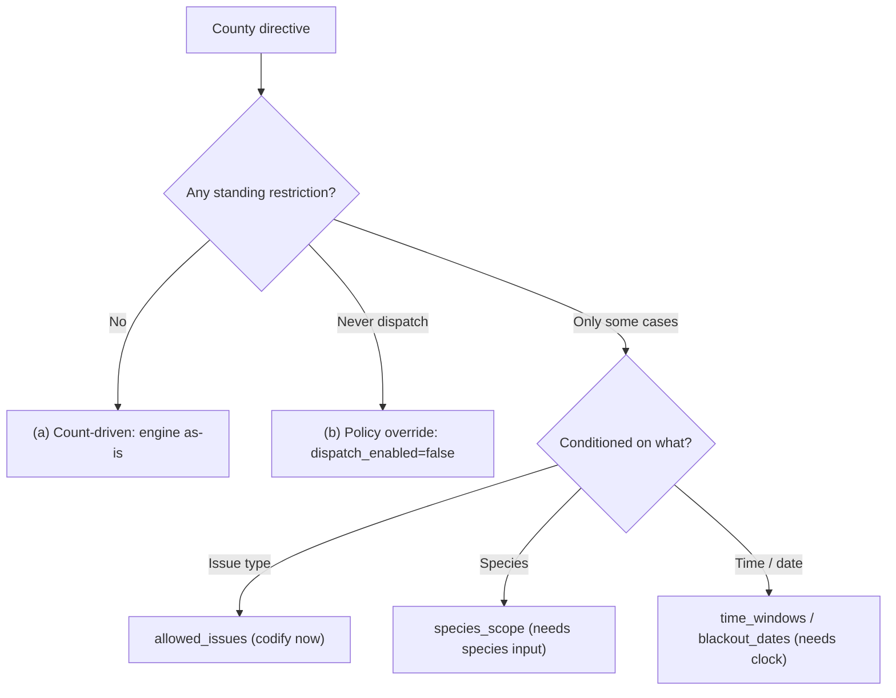
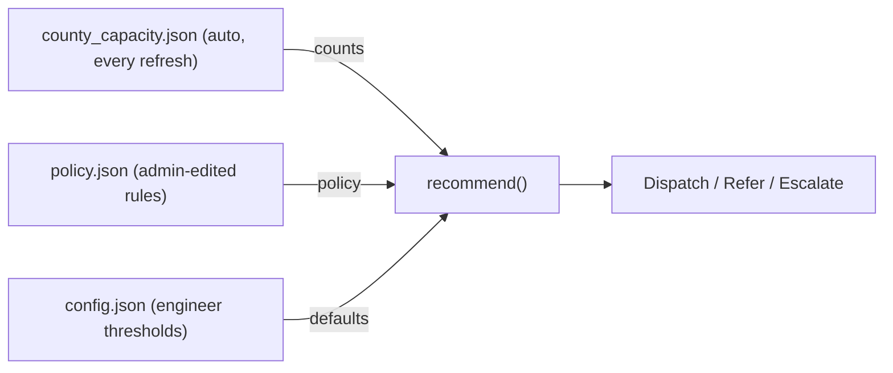
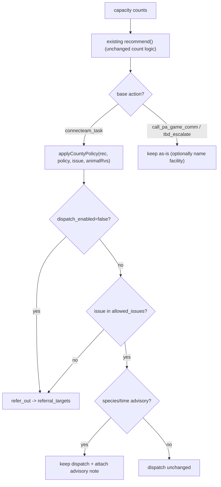

# Dispatcher Strategy Patterns — Decomposing the WIN Spreadsheet into Editable Rules

**Goal:** let the admin **edit strategy rules** (not recount volunteers), while the system **auto-reacts to live volunteer counts**. This requires splitting every county directive into the part that is *count-driven* (reacts to the snapshot automatically) and the part that is a *standing policy* (admin-set, count-independent).

**Source spreadsheet:** `data/Spreadsheet of WIN Volunteers for dispatchers update March 24.xlsx`
**Prior analysis:** `.artifacts/analysis/win-volunteer-spreadsheet-analysis.md`
**Engine reviewed:** `docs/assets/decision.js` (`recommend`), `docs/assets/dispatcher.js` (`resolveForCounty`, line ~745 call site), `docs/data/config.json`, `docs/assets/messages.js`, `docs/data/county_capacity.json`, `docs/data/facilities.json`, `docs/data/rehabbers.json`
**Date:** 2026-06-25

---

## 0. The Core Insight

Every county's instruction in the spreadsheet is the **product of two independent things**:

```
final decision  =  (is there capacity right now?)        <-  COUNT-DRIVEN  (auto, from snapshot)
                 AND (does WIN policy allow this here?)   <-  POLICY        (admin-set, standing)
```

The current engine (`recommend()` in `decision.js`) computes **only the left factor**. The admin's spreadsheet text encodes **mostly the right factor** (plus the named facility to refer to). So the admin should never be re-typing volunteer counts — those come from `county_capacity.json` every refresh. The admin should only be editing the **policy factor**: on/off, which issues, which species, which facility to name.

**Key safety property to preserve:** policy can only ever *tighten* (turn a dispatch into a referral) — it never invents a dispatch where counts say there is none. This keeps the count logic the single source of "is anyone actually available."

---

## 1. Pattern Extraction — County by County

Classification key:
- **(a) Count-driven** — "dispatch if volunteers exist." No standing restriction; engine already handles it. Reacts automatically to count changes.
- **(b) Policy override** — "always / never dispatch regardless of counts." Admin-set; count-independent.
- **(c) Conditional** — dispatch only for certain issues / species / times given counts. Hybrid: counts gate *capacity*, policy gates *scope*.

| County | Spreadsheet directive (from prior analysis) | Class | Count-driven part | Policy part (admin-editable) |
|---|---|---|---|---|
| Crawford, Lycoming, Cambria, Clearfield, Jefferson, Blair, Centre, Huntingdon, Mifflin, Carbon, Luzerne, Monroe, Allegheny, Beaver, Bedford, Fayette, Somerset, Westmoreland, York, Cumberland, Dauphin, Juniata, Perry, Berks, Schuylkill, Northampton, Bucks, Montgomery, Lancaster, Butler (~40) | "Enter dispatch for captures, transports and RVS." | **(a)** | dispatch all 3 issue types if available | none (defaults) |
| **Adams** | Do Not Enter Dispatch -> PGC / Raven Ridge / West Shore | **(b)** | — (suppressed) | `dispatch_enabled=false`; referral targets |
| **McKean, Potter, Sullivan, Susquehanna, Wyoming, Montour, Union, Greene, Franklin, Fulton** | Do Not Enter Dispatch -> named facility/PGC | **(b)** | — (suppressed) | `dispatch_enabled=false`; referral targets |
| **Armstrong** | Transport-only; captures -> Wildbird/Forest Friends/Humane | **(c)** | dispatch transport if courier/C&T avail | `allowed_issues=[transport]`; capture referral |
| **Indiana, Columbia, Snyder** | Transport-only -> rehabbers | **(c)** | dispatch transport if avail | `allowed_issues=[transport]`; capture/RVS referral |
| **Clinton** | Capture-only; transport+RVS -> Centre Wildlife | **(c)** | dispatch capture if C&T avail | `allowed_issues=[capture]`; transport+RVS referral |
| **Bradford** | Capture+transport; RVS -> PGC | **(c)** | dispatch capture/transport if avail | `allowed_issues=[capture,transport]`; RVS referral |
| **Tioga** | Capture+transport; RVS -> Good Samaritan/PGC | **(c)** | dispatch capture/transport if avail | `allowed_issues=[capture,transport]`; RVS referral target |
| **Washington** | Capture+transport; RVS -> Humane/Forest Friends (+HARP no waterfowl) | **(c)** | dispatch capture/transport if avail | `allowed_issues=[capture,transport]`; RVS referral; species exclusion note |
| **Northumberland** | Capture+transport (no RVS line) | **(c)** | dispatch capture/transport if avail | `allowed_issues=[capture,transport]` |
| **Erie, Mercer, Venango, Warren, Clarion** | RVS — **Bats only**; other RVS -> Humane/PGC | **(c)** | dispatch RVS if RVS C&T avail | `species_scope.rvs=[bats]`; non-bat RVS referral |
| **Chester** | C&T — **Birds only** + transports; other captures -> rehabbers | **(c)** | dispatch capture/transport if avail | `species_scope.capture=[birds]`; non-bird capture referral |
| **Lebanon** | **Waterfowl / Water Birds / Birds of Prey only**; else -> Red Creek / Helping Hands / Raven Ridge / West Shore | **(c)** | dispatch capture if avail | `species_scope.capture=[waterfowl,waterbirds,raptors]`; else referral |
| **Lehigh** | C&T avail after 5PM wkdays & weekends; else -> Cricket/AARK/Red Creek/Helping Hands/Pocono | **(c)** | dispatch if avail | `time_windows`; off-window referral |
| **Delaware** | C&T only Wed 12–8 / Thu 2–8 / Sun 2–6; else -> rehab ctrs | **(c)** | dispatch if avail | `time_windows`; off-window referral |
| **Philadelphia** | Transport only after 2PM weekdays | **(c)** | dispatch transport if avail | `allowed_issues=[transport]`; `time_windows` |
| **Lackawanna, Wayne, Pike** | No C&T nor RVS C&T **May 29–31** -> PGC / Pocono | **(c)** | dispatch if avail | `blackout_dates`; blackout referral |
| **Monroe** (transporter note) | Transporter unavail 10/3/26–10/18/26 | **(c)** | — | `blackout_dates` (volunteer-level; better sourced from snapshot) |
| Zero-volunteer counties absent from snapshot (Bradford, Cambria, Clarion, Clearfield, Forest, Franklin, Fulton, Greene, Jefferson, Juniata, McKean, Montour, Potter, Snyder, Sullivan, Susquehanna, Union, Wayne, Wyoming) | refer out | **(b)/(a)** | engine already -> "call PGC" (Branch A) | optionally name specific facility |

**Distribution:** ~40 pure count-driven (a), ~11 hard policy overrides (b), ~17 conditional (c). The conditional bucket splits further by *what* it conditions on: **issue scope** (codifiable today), **species scope** (needs a new input), **time/date** (needs runtime clock).



---

## 2. Proposed Data Model — Per-County Policy Schema

A new optional block **per county**. It lives alongside (not inside) the numeric thresholds so "rules" and "tuning knobs" stay visually separate for the admin. All fields optional → **absent = today's behavior** (fully backward compatible).

```jsonc
{
  "county": "Adams",
  "dispatch_enabled": "false",         // "true" | "false" | "conditional"
  "allowed_issues": ["transport"],     // subset of ["capture","transport","rvs"]; omit/null = all
  "min_thresholds": {                  // COUNT-DRIVEN overrides (already supported today)
    "ct_rvs_capture_min_available": 1,
    "ct_any_capture_min_available": 1,
    "courier_transport_min_available": 1
  },
  "species_scope": {                   // optional; advisory until a species input exists
    "capture": ["birds"],              // e.g. Chester
    "rvs": ["bats"]                    // e.g. Erie/Mercer/Venango/Warren/Clarion
  },
  "time_windows": [                    // optional; advisory until runtime clock wired
    { "days": ["Wed"], "from": "12:00", "to": "20:00" }
  ],
  "blackout_dates": [                  // optional; advisory
    { "from": "2026-05-29", "to": "2026-05-31", "scope": ["capture","rvs"] }
  ],
  "referral_targets": [                // WHERE to send when not dispatching
    { "name": "Raven Ridge Wildlife Center", "phone": "7173274811",
      "for_issues": ["capture","rvs"], "notes": "" },
    { "name": "West Shore Wildlife Center", "phone": "7172689574",
      "for_issues": ["transport"], "notes": "" }
  ],
  "special_notes": "HARP not accepting waterfowl from this county."   // free text for dispatchers
}
```

### Field meanings (admin-facing plain language)

| Field | Admin sees it as | Drives behavior? | Reacts to counts? |
|---|---|---|---|
| `dispatch_enabled` | "Can WIN dispatch here at all?" toggle: On / Off / Only some cases | **Yes** (hard gate) | No — admin-set |
| `allowed_issues` | "What can we dispatch for?" checkboxes: Capture / Transport / RVS | **Yes** | No — admin-set |
| `min_thresholds` | "How many volunteers needed before we still escalate?" | **Yes** | **Yes** — count rule |
| `species_scope` | "Limit to these species" chips | Phase 2 (advisory first) | partial |
| `time_windows` | "Only during these hours" | Phase 3 (advisory first) | No |
| `blackout_dates` | "Not available these dates" | Phase 3 (advisory first) | No |
| `referral_targets` | "If we can't take it, send here" facility picker | display only | No |
| `special_notes` | free text | display only | No |

### Where the live counts come from (NOT in this schema)
Counts stay in `county_capacity.json`, regenerated every refresh by the Monday pipeline. The editor **shows them read-only** next to the rules. This is the heart of the requirement: **the admin edits the right column (rules); the left column (counts) updates itself.**

### Storage decision — separate `policy.json`, not `config.json`
Recommendation: a **new `docs/data/policy.json`** keyed by county, rather than overloading `config.json -> county_overrides`.

- `config.json` is engineer-owned numeric tuning; mixing free-text referral lists and species chips into it muddies that contract and risks the admin breaking thresholds.
- A dedicated `policy.json` can be regenerated/validated independently and diffed cleanly in git.
- `min_thresholds` is the one count-driven field that overlaps `config.json`; keep it in `policy.json` for a single admin surface, and have `resolveForCounty()` read it from policy (falling back to `config.json.county_overrides` then global defaults) so there is one merge order.



---

## 3. Editor UI Concept — a new page on the existing GitHub Pages site

A new static page **`docs/policy-editor.html`** (same header/footer/CSS tokens as `dispatcher.html`), gated behind a lightweight access step (see Open Questions). It loads `policy.json` + `county_capacity.json` + `facilities.json`/`rehabbers.json` with the same `fetch(..., {cache:'no-store'})` pattern already used in `dispatcher.js` (lines ~3636–3647).

### 3a. Layout

```
+- Policy Editor -----------------------------------------------+
|  County: [ Adams v ]            WIN Area 13 . Coordinator: ... |
|                                                                |
|  +- LIVE COUNTS (read-only, from last refresh) -------------+  |
|  |  C&T (non-RVS): 0   RVS C&T: 0   Courier: 1              |  |
|  |  (i) auto-updates each refresh - you don't edit these    |  |
|  +----------------------------------------------------------+  |
|                                                                |
|  +- STRATEGY RULES (you edit these) ------------------------+  |
|  |  Dispatch here?   ( ) On  (o) Off  ( ) Only some cases    |  |
|  |  Allowed for:     [x]Capture [x]Transport [x]RVS  (dim    |  |
|  |                    when Dispatch=Off)                     |  |
|  |  Species limit:   [+ add chip]   (advisory)              |  |
|  |  Time windows:    [+ add]        (advisory)              |  |
|  |  Refer to:        [Raven Ridge v] [West Shore v] [+ add] |  |
|  |  Notes:           [ free text ... ]                       |  |
|  +----------------------------------------------------------+  |
|                                                                |
|  [ Preview recommendation ]   [ Save changes ]                 |
+----------------------------------------------------------------+
```

Plus a **table view** (all counties at a glance) with columns: County · Dispatch? · Allowed Issues · # Referral Targets · Has Notes — click a row to edit. This lets the admin scan the ~25 restricted counties quickly.

### 3b. Controls per field
- `dispatch_enabled` -> 3-state radio (On / Off / Only some cases).
- `allowed_issues` -> 3 checkboxes; auto-disabled & ignored when Dispatch=Off.
- `min_thresholds` -> small number steppers, **labeled as count rules** ("escalate if fewer than N available") so the admin understands these *interact with* the live counts.
- `species_scope` / `time_windows` / `blackout_dates` -> "add chip / add row" repeaters, each visibly tagged **"advisory only for now"** until Phases 2/3 land.
- `referral_targets` -> searchable dropdown populated from `facilities.json` + `rehabbers.json` (name+phone auto-filled), with manual add fallback; multi-select with per-target `for_issues`.
- `special_notes` -> textarea.

### 3c. How the editor distinguishes count-driven vs policy
Visual separation is the mechanism:
- **Top card = LIVE COUNTS**, read-only, greyed, with an "auto-updates" note. The admin physically cannot type here.
- **Bottom card = STRATEGY RULES**, all editable.
- The one bridge field (`min_thresholds`) sits in the rules card but is explicitly worded as "how the count rule behaves" so it's clear it *consumes* the counts above rather than overriding them.

A **"Preview recommendation"** button runs the real `recommend()` + the new policy layer against the current live counts for a sample Capture/Transport/RVS, so the admin sees the effect of their rule immediately ("With these rules, a Capture in Adams -> Refer to Raven Ridge").

### 3d. How changes get saved (three options — pick in Open Questions)
This is a **static GitHub Pages site (no server)**, so "Save" cannot write a file directly. Options:

1. **Export-and-commit (simplest, no backend):** "Save changes" serializes the edited `policy.json` and offers **Download** + a **copy-to-clipboard** of the JSON, plus a pre-filled link to edit `docs/data/policy.json` in GitHub's web editor. The admin pastes & commits. Pages redeploys; the live site picks up new rules on next load. Zero infra, fully auditable via git history.
2. **GitHub API write (smoother, needs a token):** the page uses a GitHub fine-grained PAT (entered by the admin, stored only in `localStorage`) to `PUT` the new `policy.json` via the Contents API and auto-commit. One-click save; requires the admin to hold a scoped token.
3. **Tiny Worker endpoint (smoothest, most infra):** the existing Cloudflare Worker (`worker/`) gains an authenticated `POST /policy` that commits the file. Centralizes auth; most build/ops work.

Recommended default: **Option 1** for v1 (matches the project's existing "static + git" philosophy and the `refresh_monday.py` -> commit data flow), with Option 2 as a fast-follow if the admin wants one-click.

---

## 4. Integration Sketch — how `recommend()` consumes the policy layer

### Current flow
```
counts -> threshold check -> action in {connecteam_task, call_pa_game_comm, tbd_escalate}
```
`recommend(capacity, animalRvs, issue, resolvedConfig)` returns purely on counts vs thresholds.

### Proposed flow
```
counts -> threshold check -> BASE action -> applyCountyPolicy(...) -> FINAL action
```
Policy runs as a **post-step that can only down-grade** a `connecteam_task` into a referral, or attach an advisory string. It never upgrades a referral into a dispatch.



### What changes in `decision.js`
- Add a new action tone **`refer_out`** to `ACTIONS` (CSS class + label key), parallel to the existing three.
- Add a pure function `applyCountyPolicy(rec, countyPolicy, issue, animalRvs)` called at the **end** of `recommend()` (or wrapped around it) that:
  - if `dispatch_enabled === "false"` -> set `rec.action='refer_out'`, attach `rec.referral_targets`, push a reasoning line.
  - else if `allowed_issues` present and the issue (or RVS) not in it -> same referral down-grade.
  - else if `species_scope`/`time_windows` present -> leave `rec.action` as dispatch but push an **advisory** reasoning line (`rec.advisory = true`) — until Phases 2/3 wire real gating.
- Extend `recommend()`'s signature to accept the county policy (e.g. `recommend(capacity, animalRvs, issue, resolvedConfig, countyPolicy)`), keeping `countyPolicy` optional so existing call sites and Node tests stay valid.

### What stays the same
- The entire count branch logic (A–E) is untouched — it remains the single source of "is there capacity."
- `enrichMarginal`, `qualifiesForAnimal`, `qualifyingRoles` unchanged.
- `messages.js` stays data-only: add keys `referOut`, `dispatchDisabled`, `issueNotAllowed`, `speciesAdvisory`, `timeWindowAdvisory`, plus `actionLabels.refer_out`.

### What changes in `dispatcher.js`
- `loadConfig()` gains a sibling `loadPolicy()` (`fetch('data/policy.json')`) into `state.policy`.
- `resolveForCounty()` additionally pulls `min_thresholds` from `policy.json` (merge order: policy -> `config.json.county_overrides` -> global defaults).
- The two `recommend()` call sites (lines ~745–747) pass `state.policy[county]` as the new arg.
- `renderRecommendation()` learns to render the `refer_out` tone (amber, with the named facility list) and the advisory note.

**Phasing** (maps to the 3 conditional sub-types):
- **Phase 1 (now):** `dispatch_enabled` + `allowed_issues` + `referral_targets` + `min_thresholds`. Fixes the hard contradictions (Adams, Clinton, Washington) with no new input fields.
- **Phase 2:** `species_scope` becomes a hard gate once a species/taxon input is added to the animal form.
- **Phase 3:** `time_windows` + `blackout_dates` become hard gates once `recommend()` receives a `now` timestamp.

---

## 5. Open Questions for the User / Admin

1. **Save mechanism:** Option 1 (download + paste into GitHub web editor), Option 2 (admin holds a GitHub token for one-click save), or Option 3 (Worker endpoint)? This drives all of the editor's "Save" plumbing and the auth story.
2. **Who may edit / access control:** the site is public GitHub Pages. Should the editor page be obscured (unlinked URL), password-gated client-side, or protected by the same mechanism chosen in Q1? What's acceptable given it's wildlife dispatch policy, not secrets?
3. **`config.json` vs new `policy.json`:** OK to introduce a separate `policy.json` (recommended), or must everything stay in `config.json`?
4. **Phase-1 scope confirmation:** Is it acceptable to ship species/time/blackout rules as **advisory text first** (visible to dispatchers but not auto-blocking), with hard gating in later phases? Or is a hard species gate required on day one (which needs a new species input on the animal form)?
5. **Species taxonomy:** if/when species becomes a hard gate, what is the canonical species/taxon list (bats, raptors, waterfowl, water birds, songbirds, mammals, reptiles…)? Who maintains the mapping from a caller's free-text animal description to a taxon?
6. **Referral target source of truth:** should `referral_targets` reference existing `facilities.json`/`rehabbers.json` entries by id/name (so phones stay in sync), or store name+phone snapshots inline (resilient but can drift)?
7. **Down-grade-only guarantee:** confirm policy must **never** create a dispatch where counts say none — i.e. policy can only refer-out, never override an escalation into a dispatch. (Assumed yes; the whole design depends on it.)
8. **Blackout/availability dates:** several blackouts are really *individual volunteer* availability (Monroe transporter Oct 3–18). Should those stay in the policy editor, or are they better captured upstream in the Monday availability snapshot so counts drop automatically?
9. **Zero-volunteer absent counties (19):** should the editor let the admin pre-author policy for counties that have no snapshot entry today (so referrals are named even before any volunteer exists there)?
10. **Preview fidelity:** is a 3-row preview (Capture / Transport / RVS against current live counts) enough, or does the admin want a full per-issue x per-species matrix preview?

---

## Bottom Line

- The spreadsheet decomposes cleanly: **~40 counties are pure count-driven (no admin action needed), ~11 are hard policy overrides (on/off), ~17 are conditional (issue/species/time scoped).**
- A small **per-county `policy.json`** captures the policy factor; **`county_capacity.json` keeps owning the counts**, so volunteer changes flow through automatically and the admin never recounts.
- The engine change is **additive and strictly tightening**: an `applyCountyPolicy()` post-step that can only turn a dispatch into a named referral, leaving the proven count logic untouched.
- **Phase 1** (dispatch on/off + allowed issues + referral targets) is buildable now with no new animal-input fields and resolves every hard contradiction; species and time gating are later phases that need new inputs/clock context.
- The **editor UI** separates a read-only "live counts" card from an editable "strategy rules" card, making the count-driven vs policy distinction obvious; the only real decision blocking the build is the **save/auth mechanism** (Open Questions 1–2).
