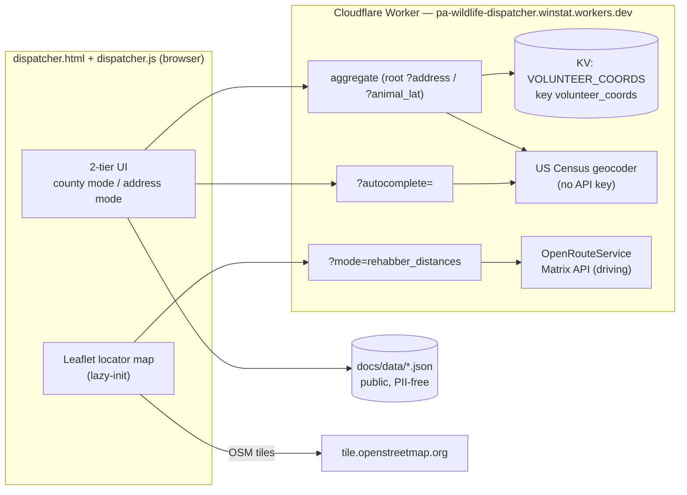
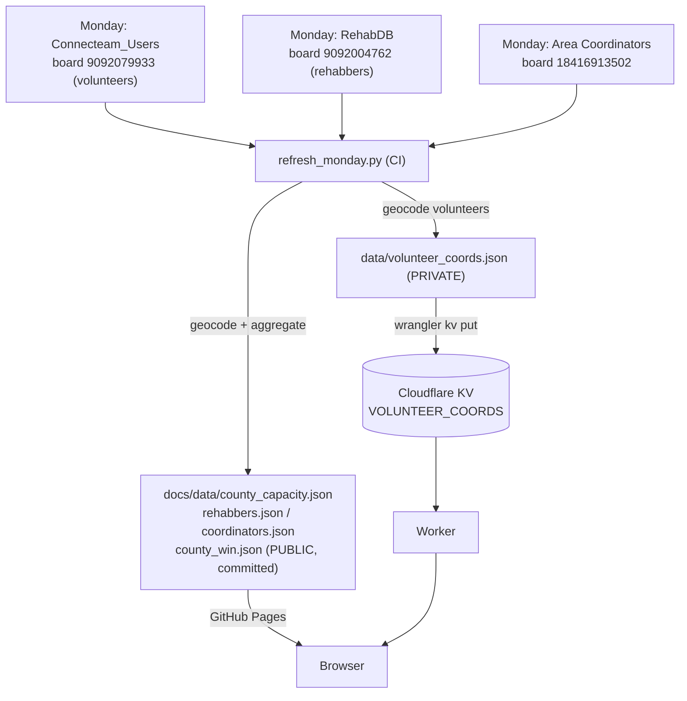
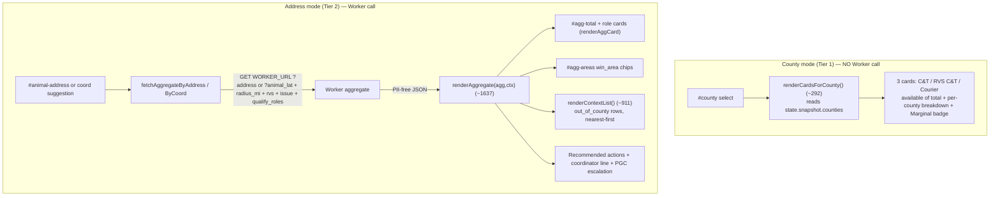
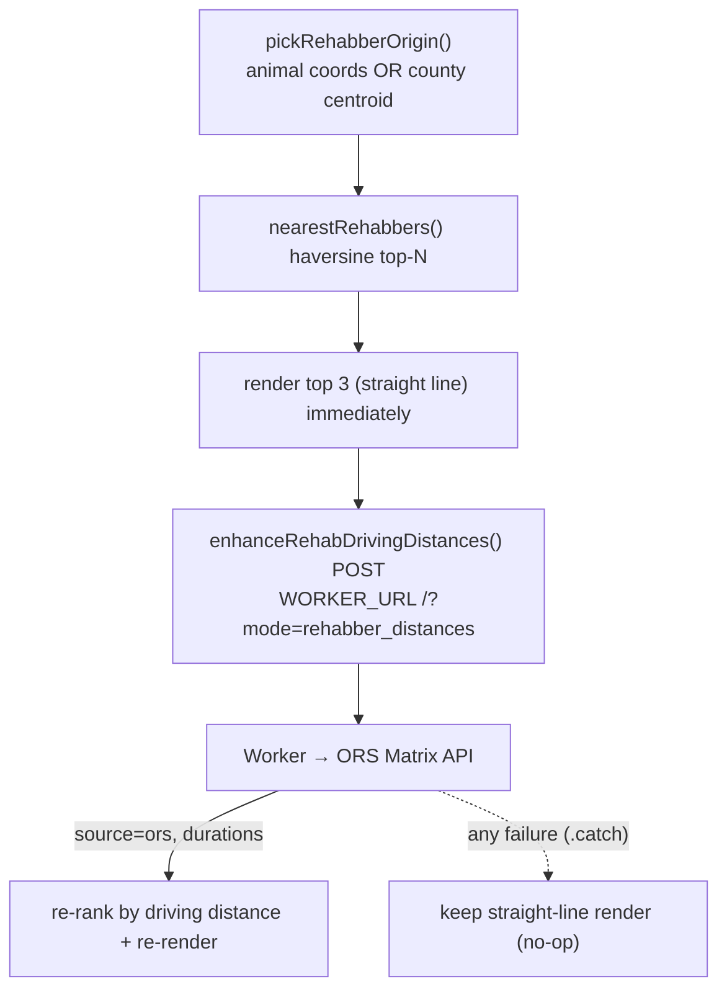
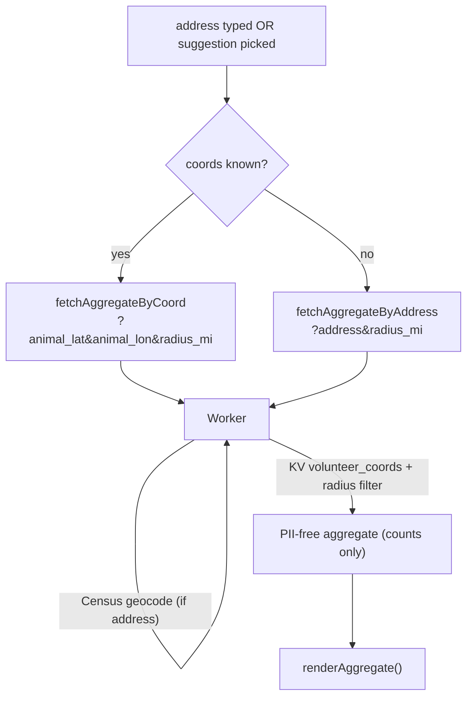
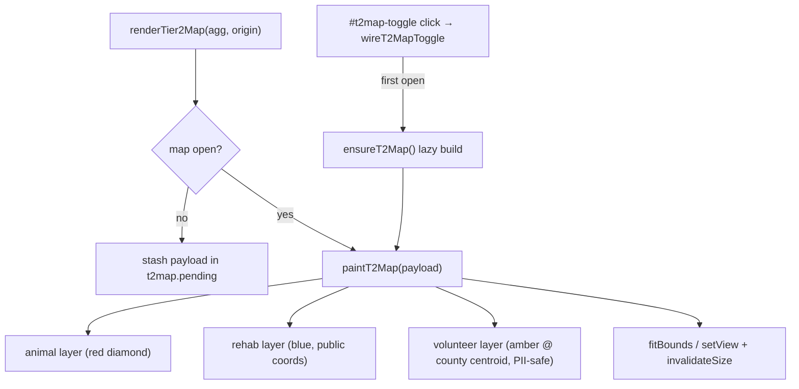

# Dispatch Helper — Architecture & Maintainer Guide

> App: **Dispatcher Console** (`docs/dispatcher.html` + `docs/assets/dispatcher.js`)
> A no-framework, no-build vanilla-JS console that helps a dispatcher find
> qualified volunteers and nearby rehabbers for a wildlife rescue.
> It is the only app that talks to a **Cloudflare Worker** (the PII boundary)
> and an **interactive Leaflet map**.

---

## 1. The big picture

The dispatcher enters either a **county** (Tier 1, fast capacity overview) or an
**animal address** (Tier 2, precise radius search). The browser **never sees
volunteer coordinates or PII** — those live in Cloudflare KV behind a Worker,
which only ever returns PII-free aggregate counts plus the *animal* coordinate
(safe) and *public* rehabber coordinates.



**Golden rule:** the browser fetches only (a) the one Worker origin, (b) OSM map
tiles, and (c) local `docs/data/*.json`. Every third-party provider (Census,
Photon autocomplete, ORS routing) is proxied through the Worker so there is a
**single CORS surface** and the browser never holds an API key.

---

## 2. File inventory

| Absolute path | Role |
| --- | --- |
| `/Users/P1/Projects/PA-Wildlife-Rehab/docs/dispatcher.html` | Markup + CSS for the 2-tier console (~1396 lines). Defines panels by `data-panel-key`. |
| `/Users/P1/Projects/PA-Wildlife-Rehab/docs/assets/dispatcher.js` | All app logic (~2830 lines, single IIFE). Fetch, render, map, stale-handling. |
| `/Users/P1/Projects/PA-Wildlife-Rehab/docs/assets/messages.js` | `window.WildlifeMessages` — all user-facing wording + thresholds. Loaded **before** dispatcher.js. |
| `/Users/P1/Projects/PA-Wildlife-Rehab/docs/assets/decision.js` | `window.WildlifeDecision` — qualification + recommendation logic (single source of truth for which roles qualify). |
| `/Users/P1/Projects/PA-Wildlife-Rehab/docs/assets/flags.js` | Shared maintenance-flag runtime. |
| `/Users/P1/Projects/PA-Wildlife-Rehab/docs/assets/vendor/leaflet/leaflet.js` `…/leaflet.css` | **Vendored** Leaflet (so it works on `file://` and Pages; only tiles need network). |
| `/Users/P1/Projects/PA-Wildlife-Rehab/docs/data/county_capacity.json` | County-mode capacity snapshot (per-county role buckets). CI-refreshed. |
| `/Users/P1/Projects/PA-Wildlife-Rehab/docs/data/rehabbers.json` | **Public** rehabber dataset (name, county, phone, lat/lon, availability, website). |
| `/Users/P1/Projects/PA-Wildlife-Rehab/docs/data/coordinators.json` | Area → coordinator **name** (never phone). Board-sourced. |
| `/Users/P1/Projects/PA-Wildlife-Rehab/docs/data/win_area_coordinators.json` | Static fallback for coordinators.json. |
| `/Users/P1/Projects/PA-Wildlife-Rehab/docs/data/county_win.json` | County → WIN-area map (PII-free). |
| `/Users/P1/Projects/PA-Wildlife-Rehab/docs/data/pa_counties.json` | PA county GeoJSON: choropleth + county centroids. **Shared with the Worker.** |
| `/Users/P1/Projects/PA-Wildlife-Rehab/docs/data/config.json` | Optional threshold overrides (404 ⇒ defaults). |
| `/Users/P1/Projects/PA-Wildlife-Rehab/worker/` | The Cloudflare Worker (see `ARCHITECTURE_SYSTEM.md`). |

Script load order in `dispatcher.html` (~lines 1390–1394):
`leaflet.js → flags.js → messages.js → decision.js → dispatcher.js`.

---

## 3. The 2-tier UI

Shared at the top: **animal base info** (`#animal-base-info`,
`data-panel-key="dispatcher-animal-base-info"`) — two radio groups read once by
`readAnimalBaseInfo()` (dispatcher.js ~456):

- `name="rvs"` → `yes`/`no` (is this a rabies-vector species?)
- `name="issue"` → `capture`/`transport`

Both search paths consume this single input and derive the qualifying volunteer
roles via `window.WildlifeDecision.qualifyingRoles(rvs, issue)`.

**Mode toggle** (`role="radiogroup"`, `name="mode"`): `county` (default) vs
`address`. `setMode(mode)` (~2630) flips the `hidden` attribute on the two
panels:

| Panel | Element | `data-panel-key` |
| --- | --- | --- |
| County mode (Tier 1) | `#county-mode` | `dispatcher-county-mode` |
| Address mode (Tier 2) | `#address-mode` | `dispatcher-address-mode` |
| Rehabber list block | `#…rehab-block` | `dispatcher-rehab-block` |
| Map block | `#t2map-block` | `dispatcher-t2map-block` |
| Map panel | `#t2map` wrapper | `dispatcher-map-panel` |

**Deconfliction:** `state.activeLocation` (`'county'` | `'address'`) is the
"whichever input was used last wins" flag, so the county coordinator line and the
address coordinator line never both display. `renderAggregate` rebinds it to
`'address'`; switching to county mode or changing the county rebinds it to
`'county'`.

---

## 4. Config constants (top of dispatcher.js)

| Constant | Line | Value / meaning |
| --- | --- | --- |
| `WORKER_URL` | 115 | `https://pa-wildlife-dispatcher.winstat.workers.dev` — the Worker origin. |
| `RADIUS_DEFAULT` / `RADIUS_MAX` | 116–117 | `20` / `100` miles. |
| `AC_MIN_CHARS` / `AC_DEBOUNCE_MS` / `AC_LIMIT` | 121–123 | Autocomplete tuning (`3` / `280ms` / `5`). |
| `GEOJSON_PATH` | 62 | `data/pa_counties.json`. |
| `MAP_PANEL_KEY` | 63 | `win_map_panel_open` (localStorage key for map open/closed). |
| `QUALIFYING_ROLES` | 128 | `['C&T','RVS C&T','COURIER']`. |
| `T2_EST_SPEED_MPH` | 1360 | `40` — used only for the map popup *estimated* time fallback. |
| `SHOW_VOLUNTEER_MARKERS` | 1347 | `true` — master switch for volunteer map pins (clearly fenced `VOLUNTEER MARKERS START/END`). |

There is **no ORS key or ORS URL in the frontend** — driving distances come only
through the Worker.

---

## 5. Data path A — Monday.com → volunteer data + rehabber base (build-time)

The dispatcher's data is produced offline by CI, not at request time. The
`refresh_monday.py` job (see `ARCHITECTURE_SYSTEM.md`) reads Monday boards,
geocodes, and writes:

- **PUBLIC** aggregates committed to `docs/data/*.json` (capacity, rehabbers,
  coordinators, county_win) — served by GitHub Pages and fetched directly by the
  browser.
- **PRIVATE** `data/volunteer_coords.json` — pushed to Cloudflare KV
  (`VOLUNTEER_COORDS`, key `volunteer_coords`), never committed, never served to
  the browser.



`county_capacity.json` is loaded by `loadSnapshot()` (~2725) into
`state.snapshot`; `rehabbers.json` by `loadRehabbers()` (~2715);
`coordinators.json` by `loadCoordinators()` (~2702, falling back to
`win_area_coordinators.json`). All loaders swallow errors into empty defaults.

---

## 6. Data path B — Worker `aggregate` → county-mode summary + address-mode counts

**Important naming note:** there is **no literal `/aggregate` path segment**. The
"aggregate" *is* the Worker root, selected by query params:

- by address: `WORKER_URL + '?address=…&radius_mi=…'` →
  `fetchAggregateByAddress()` (~592)
- by explicit coords: `WORKER_URL + '?animal_lat=…&animal_lon=…&radius_mi=…'` →
  `fetchAggregateByCoord()` (~628)

`appendAggregateOpts()` (~648) appends `&rvs=`, `&issue=`, and the derived
`&qualify_roles=`. `fetchAggregate(url)` (~667) does `fetch(url,{cache:'no-store'})`
and maps HTTP status to stable codes (`422→address_not_found`,
`502→geocoder_unavailable`, `400→worker_400`).

The Worker reads volunteer coords from KV, counts qualifying volunteers in
radius, and returns a **PII-free aggregate**:

```json
{
  "total_in_range": 19,
  "role_counts": { "C&T": 2, "RVS C&T": 5, "COURIER": 12 },
  "role_available": { "C&T": 1, "RVS C&T": 4, "COURIER": 9 },
  "win_areas": ["10"],
  "animal_lat": 40.44, "animal_lon": -79.99,
  "animal_county": "Allegheny", "animal_area": "10",
  "out_of_county": [ /* nearest-first qualified rows, no PII */ ]
}
```



- **County-mode counts** are computed **locally** from `county_capacity.json`
  (no Worker call). `renderCardsForCounty()` expands across the WIN area via
  `getWinAreaCounties()` (~235) and fills the three role cards
  (`ct_no_rvs`→"C&T", `ct_rvs`→"RVS C&T", `courier`→"Courier"), each showing
  `available of total`, a per-county sub-breakdown, and a "Marginal" badge when
  availability is at/under the threshold.
- **Address-mode counts** come from the Worker's `role_counts`/`role_available`/
  `total_in_range`/`win_areas`, rendered by `renderAggregate()` (~1637). The
  `out_of_county` rows are **pre-sorted nearest-first by the Worker** and that
  order is preserved in `renderContextList()`.

---

## 7. Data path C — Worker `?mode=rehabber_distances` → nearest rehabbers (ORS)

`renderNearestRehabbers(origin)` (~1168) first ranks a pool of rehabbers by
**haversine** (straight line, `nearestRehabbers` ~707) and renders the top 3
immediately. Then `enhanceRehabDrivingDistances()` (~1123) **POSTs** to
`WORKER_URL + '/?mode=rehabber_distances'` to upgrade to **ORS driving
distance**:

```js
var url = WORKER_URL + '/?mode=rehabber_distances';
var body = {
  origin: { lat: origin.lat, lon: origin.lon },
  destinations: pool.map(r => ({ lat: r.lat, lon: r.lon }))
};
fetch(url, { method:'POST',
             headers:{'Content-Type':'application/json'},
             body: JSON.stringify(body) });
```

On success (requires `data.source === 'ors'` and ≥1 usable `duration_min`) it
writes `drive_distance_mi`/`duration_min` back into the pool, re-ranks by driving
distance, and re-renders. **Pure enhancement:** any failure (no ORS key, network
error, missing durations) is caught and the straight-line render is kept. Origin
is chosen by `pickRehabberOrigin()` (~1313): the animal coords if present, else
the selected county's **centroid** (`state.countyCentroids`).



Rehabber coordinates are **public**, so sending them to ORS via the Worker is
PII-safe.

---

## 8. Data path D — Worker address-radius volunteer query

The address-mode aggregate (path B) is the volunteer-radius query. The Worker
accepts either `?address=` (it geocodes server-side via US Census) or
`?animal_lat=&animal_lon=` (pre-resolved), plus `radius_mi` (default 20, clamped
to 100), and returns the counts of volunteers within the radius — **as
aggregates only**, never per-volunteer rows. The browser supplies coordinates
when an autocomplete suggestion already carries Photon-resolved lat/lon
(`fetchAggregateByCoord`), bypassing the weaker Census exact-match path.



---

## 9. Data path E — US Census geocoder (no API key)

The **browser never calls the Census geocoder directly** — doing so was the
original cross-origin (CORS) failure (see the comment at dispatcher.js ~112). The
Census geocoder (free, no key) runs **inside the Worker** behind `?address=`.
Autocomplete (`acFetch`, ~2132) hits `WORKER_URL + '?autocomplete=<q>&limit=…'`,
and the Worker proxies Photon (with a Census fallback) and returns
`{ suggestions: [{label, lat?, lon?}] }`. A sequence guard (`ac.seq`) drops stale
responses.


---

## 10. The Leaflet map module (Tier-2 locator)

Leaflet is **vendored** (`assets/vendor/leaflet/`) so it loads on `file://` and
Pages without a CDN; only map tiles need network.

- **Lazy init.** Map state is `t2map = { instance, layers, pending, open }`
  (~1349). `ensureT2Map()` (~1394) creates `L.map('#t2map').setView([40.9,-77.6],7)`
  (PA center), adds the OSM tile layer, and creates three `L.layerGroup`s:
  `animal`, `rehab`, `volunteer`. The map is only built on **first open** because
  Leaflet needs a sized, visible container.
- **Toggle.** `#t2map-toggle` (in `#t2map-block`) → `wireT2MapToggle()` (~1616)
  flips `#t2map-body[hidden]`, updates `aria-expanded` + "Show/Hide map", sets
  `t2map.open`, and paints any stashed `t2map.pending` payload. The open/closed
  state persists via `MAP_PANEL_KEY` in localStorage.
- **Markers** (`t2DivIcon()`, ~1382 — CSS DivIcons, no sprite):
  - **Animal = red diamond** (`.t2-pin-animal`, rotated red square,
    `zIndexOffset:1000`). Popup: `"<strong>Animal location</strong><br>" + label`.
  - **Rehabber = blue** (`.t2-pin-rehab`). Popup: name + distance/time + county +
    phone. Real public coordinates.
  - **Volunteer = amber at county centroid (PII)** (`.t2-pin-vol`). Plotted at
    the **home-county centroid** (`state.countyCentroids[row.county]`) because
    exact volunteer coords are never sent to the browser. Stacked pins get a
    deterministic golden-angle spiral offset. Gated by `SHOW_VOLUNTEER_MARKERS`.
- **Legend.** Static HTML `#t2map-legend` (animal/rehabber/volunteer swatches);
  the volunteer entry is shown/hidden by the flag.
- **Popup distance line.** `t2DistTimeLine(distMi, minReal)` (~1368): either
  `"10.1 miles / 15 min"` (real ORS time) or `"10.1 miles / ~15 min (est.)"`
  using `T2_EST_SPEED_MPH = 40`.
- **Paint / clear.** `paintT2Map(payload)` (~1418) calls `clearLayers()` on all
  three groups, re-plots animal → rehabbers → volunteers, accumulates bounds,
  then `setView` (single point) or `fitBounds(...,{maxZoom:13})`, and
  `invalidateSize()`. If there are no usable animal coords, `renderTier2Map`
  shows `#t2map-unavailable` instead of a broken map.



> **There is a second, separate map**: the WIN-area SVG **choropleth** built from
> `pa_counties.json` (`buildMap` ~2419, `geoCentroidLatLon` ~2386 which also
> produces `state.countyCentroids`). It is an inline SVG, *not* Leaflet, and is
> independent of the Tier-2 locator map.

---

## 11. Stale-input handling ("Approach B")

When the dispatcher changes RVS/Issue **after** results are already on screen,
the app **dims the results and shows an amber banner** telling them to re-run —
it never silently recomputes.

- **CSS** (dispatcher.html ~286): `.is-stale > *:not(.stale-notice)` gets
  `opacity:0.4; filter:grayscale(0.85); pointer-events:none`. `.stale-notice` is
  the amber banner (`background:#fff7e6; border-left:4px solid #e0a106`).
- **The banner has no fixed id** — it is created dynamically with class
  `stale-notice` and inserted as the first child of the stale surface. Its text
  comes from `MSG.stale`.
- **Functions** (dispatcher.js): `staleNoticeEl()` (~478) builds the banner;
  `markRecOutputStale()` (~496) flags `#rec-output`; `markAddressResultStale()`
  (~503) flags `#address-result` (and collapses the rehabber panel so stale rows
  can't be revealed); `markResultsStale()` (~518) flags whichever surface is
  shown; `clearStale()` (~525) removes it (called at the top of each new search).
- **Wiring** (~2775): every `input[name="rvs"], input[name="issue"]` change calls
  `markResultsStale`.

> A separate `.is-under-maintenance` dim treatment (from `flags.js`) is
> intentionally a **different class** so the two never collide.

---

## 12. Key functions reference

| Area | Functions (approx line) |
| --- | --- |
| Lifecycle | `init()` (2752), `populateCounties()` (146), `renderBanner()` (165) |
| County mode | `getWinAreaCounties()` (235), `renderCardsForCounty()` (292), `onRecommendClick()` (532), `renderRecommendation()` (394), `coordinatorForCounty()` (738) |
| Address fetch | `fetchAggregateByAddress()` (592), `fetchAggregateByCoord()` (628), `appendAggregateOpts()` (648), `fetchAggregate()` (667), `enhanceRehabDrivingDistances()` (1123) |
| Address render | `renderAggregate()` (1637), `renderContextList()` (911), `renderAggCard()` (1074), `renderNearestRehabbers()` (1168), `pickRehabberOrigin()` (1313) |
| Autocomplete | `acFetch` (2132), `acOnInput` (2157), `acSelect` (2111), `setupAutocomplete` (2222), `detectPinDrop` (2054) |
| Leaflet map | `ensureT2Map` (1394), `paintT2Map` (1418), `renderTier2Map` (1519), `wireT2MapToggle` (1616), `t2DivIcon` (1382) |
| SVG choropleth | `buildMap` (2419), `geoCentroidLatLon` (2386), `highlightAreas` (2529) |
| Mode/handoff | `setMode` (2630), `widenFromCounty` (2656) |
| Stale | `markResultsStale` (518), `clearStale` (525) |

---

## 13. Maintenance recommendations

**What breaks (and how to tell):**

| Symptom | Likely cause | Fix |
| --- | --- | --- |
| Address mode returns errors for every lookup | Worker down, KV empty, or CORS origin mismatch | Check the Worker is live (`curl WORKER_URL?animal_lat=40.44&animal_lon=-79.99`); verify `ALLOWED_ORIGIN` in `worker/wrangler.toml` includes the site origin; confirm CI pushed `volunteer_coords` to KV. See `ARCHITECTURE_SYSTEM.md`. |
| Rehabber distances are straight-line only ("est.") | `ORS_API_KEY` secret unset/expired, or ORS quota hit | Re-set `wrangler secret put ORS_API_KEY`; the panel degrades gracefully so this is non-urgent. |
| County cards empty / stale | `county_capacity.json` not refreshing | Check the CI `refresh.yml` run + the VolDB_Status sentinel. |
| Autocomplete returns nothing | Photon proxy path in Worker failing | Falls back to Census; verify the Worker `?autocomplete=` route. |
| Map blank / tiles missing | OSM tile server blocked or offline | Tiles are the only network dep of the map; confirm `tile.openstreetmap.org` reachable. |
| Volunteer pins need to be removed for a privacy review | — | Set `SHOW_VOLUNTEER_MARKERS = false` (line 1347); the fenced block can be deleted wholesale. |
| Page dimmed with banner | `flags.js` has `page-dispatcher` in `maintenance` | Edit `PAGES['page-dispatcher']` in `assets/flags.js`. |

**How to extend / change:**

- **Change Worker origin** (e.g. new account/domain) → `WORKER_URL` (line 115)
  **and** the Worker's `ALLOWED_ORIGIN`.
- **Change radius behavior** → `RADIUS_DEFAULT`/`RADIUS_MAX` (116–117) and the
  Worker's clamp.
- **Change qualifying-role logic** → edit `decision.js`
  (`window.WildlifeDecision`), the single source of truth shared by the frontend
  and reflected in `qualify_roles`.
- **Change wording/thresholds** → edit `messages.js` (`window.WildlifeMessages`),
  never hardcode strings in dispatcher.js.

**PII boundary (do not regress):** exact volunteer coordinates must never reach
the browser. The Worker returns only aggregate counts + the animal coordinate +
public rehabber coordinates; volunteers are mapped at county centroids. Any new
endpoint or field must preserve this. The CI commit step has a PII content-scan
guard for exactly this reason (see `ARCHITECTURE_SYSTEM.md`).

**Dependencies:** Cloudflare Worker + KV, OpenRouteService (free tier, Worker
secret), US Census geocoder (no key), Photon autocomplete, OSM tiles, vendored
Leaflet, local `docs/data/*.json`.
