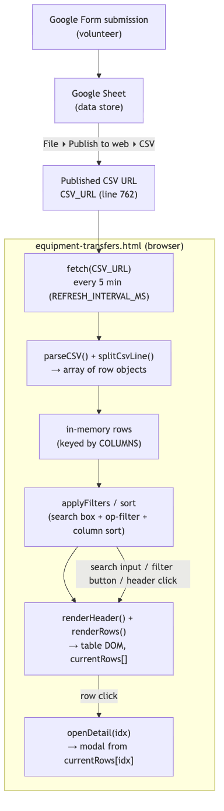

# Equipment Transfers — Architecture & Maintainer Guide

> App: **Equipment Transfers board** (`docs/equipment-transfers.html`)
> One self-contained static HTML page. No framework, no build step, no backend.
> Reads a published Google Sheet CSV, renders a sortable/filterable table, and
> opens a per-row detail modal.

---

## 1. What this app is

A read-only public board that lists wildlife-equipment transfer requests
(incubators, cages, nets, etc.) that volunteers have submitted via a Google
Form. The Form writes to a Google Sheet; the Sheet is **published to the web as
CSV**; this page fetches that CSV every 5 minutes and renders it.

There is **no server**. Everything runs in the browser. The only "API" is the
public CSV URL.

```
Google Form  ──►  Google Sheet  ──►  (File ▸ Publish to web ▸ CSV)  ──►  equipment-transfers.html
 (volunteers)      (data store)         published CSV endpoint            (this app, browser-only)
```

---

## 2. File inventory

| Absolute path | Role |
| --- | --- |
| `/Users/P1/Projects/PA-Wildlife-Rehab/docs/equipment-transfers.html` | The **entire app**: inline `<style>`, body markup, and inline `<script>`. Self-contained. |
| `/Users/P1/Projects/PA-Wildlife-Rehab/docs/assets/flags.js` | Shared maintenance-flag runtime (loaded by every page). Dims/hides panels by `data-panel-key`. See `ARCHITECTURE_SYSTEM.md`. |
| `/Users/P1/Projects/PA-Wildlife-Rehab/docs/index.html` | Home page that links to this tool (card state mirrors flags). |

The page is structurally three regions, all inside the one HTML file:

- **`<style>`** (top of file): all CSS — table, badges, modal, responsive
  mobile-sort controls, and the `.is-under-maintenance` dim styling.
- **Body markup** (`<body data-panel-key="page-equipment">`, ~line 668): header,
  controls bar (`data-panel-key="equipment-controls"`), the table wrapper
  (`data-panel-key="equipment-table"`), and the hidden detail modal.
- **Inline `<script>`** (~line 760 onward): CSV fetch, parser, render, sort,
  filter, and modal logic.

No external JS except `assets/flags.js`. No CSS frameworks.

---

## 3. Key identifiers (so you can grep fast)

| Symbol | Line (approx) | Purpose |
| --- | --- | --- |
| `CSV_URL` | 762 | Published Google Sheet CSV endpoint (the data source). |
| `REFRESH_INTERVAL_MS` | 763 | `5 * 60 * 1000` — auto-refresh cadence. |
| `COLUMNS` | 768 | Array of `{ key, label }` — defines column order, headers, and which fields show in the table/modal. **This is the schema contract with the Sheet.** |
| `sortKey` / `sortDir` | 786–787 | Current sort state. Default `'Subission Date'` (note the original Sheet header spelling) descending. |
| `parseCSV(text)` | 790 | RFC-4180-ish parser; handles quoted fields and newlines inside quotes. |
| `splitCsvLine(line)` | 824 | Splits one record on unquoted commas. |
| `escapeHTML(str)` | 842 | XSS-safe escaping for every rendered cell. |
| `normalizeOp(v)` | 854 | Normalizes the "operational" status value for the colored badge. |
| `parseDate(v)` | 861 | Date coercion for date-aware sorting. |
| `renderHeader()` | 868 | Builds `<th>` cells; binds the click-to-sort handler once. |
| `renderRows(rows)` | 895 | Builds table body; stashes `currentRows` for modal lookup; updates `#results-count`. |
| `openDetail(idx)` / `closeDetail()` | 948 / 986 | Row-detail modal open/close. |

The `currentRows` array (set inside `renderRows`) is the bridge between the table
and the modal: each row's click passes its index, and `openDetail` reads
`currentRows[idx]`.

---

## 4. Data flow (CSV → fetch → parse → render → search/filter/sort → modal)



Step by step:

1. **Fetch.** On load and then every `REFRESH_INTERVAL_MS` (5 min), the script
   `fetch`es `CSV_URL`. The URL is the Google "publish to web" CSV endpoint
   (`.../pub?output=csv`); no auth, no key.
2. **Parse.** `parseCSV` splits the raw text into records (respecting quoted
   newlines), then `splitCsvLine` splits each record into fields. Row 0 is the
   header; remaining rows become objects keyed by the trimmed header names.
   Empty rows are dropped (`.filter(r => Object.values(r).some(v => v))`).
3. **Render.** `renderHeader` paints the `<th>` cells (column order/labels come
   from `COLUMNS`) and wires a single click handler per header for sorting.
   `renderRows` paints the `<tbody>`, applies the operational-status badge via
   `normalizeOp`, stashes the rendered rows in `currentRows`, and updates the
   results count.
4. **Search / filter / sort.** The controls bar provides a free-text search and
   an operational-status filter group (`.op-filters`). Clicking a column header
   toggles `sortKey`/`sortDir` (date columns sort via `parseDate`). On small
   screens a `.mobile-sort` `<select>` + direction button mirror the header
   sort. Any of these re-runs the render against the in-memory rows — **no
   re-fetch is needed to search/sort.**
5. **Row-detail modal.** Clicking a row calls `openDetail(idx)`, which reads
   `currentRows[idx]` and fills `#modal-title`/`#modal-subtitle`/`#modal-body`
   with every column except `Equipment`/`ID` (those become the title/subtitle).
   The modal (`#modal-backdrop`) is closed via the ✕ button, backdrop click, or
   `Esc`.

---

## 5. The Sheet contract (most important thing to understand)

The app is only as correct as the **column headers in the published Sheet match
the `key` values in `COLUMNS`** (line 768). Each entry is:

```js
const COLUMNS = [
  { key: 'Equipment',       label: 'Equipment' },
  { key: 'Subission Date',  label: 'Submitted' },   // header spelling matches the Sheet
  // ...
];
```

- `key` MUST equal the Sheet column header **exactly** (including any historical
  typo such as `Subission Date`). If someone "fixes" a header in the Sheet, the
  matching `key` here must change too or that column silently renders blank.
- `label` is display-only and can be changed freely.
- To add a column: add the header in the Sheet, then add a `{ key, label }`
  entry to `COLUMNS`. To remove/reorder columns: edit `COLUMNS` only.

---

## 6. Maintenance recommendations

**What breaks (and how to tell):**

| Symptom | Likely cause | Fix |
| --- | --- | --- |
| Table empty / "No transfers match" with no filter | Sheet un-published, URL rotated, or sharing changed | Re-publish the Sheet (File ▸ Publish to web ▸ CSV) and update `CSV_URL` (line 762). |
| One column is blank for every row | Sheet header renamed and no longer matches a `COLUMNS` `key` | Re-sync the `key` to the new header. |
| Dates sort wrong | Sheet date format changed so `Date.parse` fails | Adjust `parseDate` (line 861) or standardize the Sheet date format. |
| Badge color missing/wrong | New operational value not handled | Extend `normalizeOp` (line 854) and the `.op-badge` CSS. |
| Page dimmed with a banner | `flags.js` has this page in `maintenance` | Edit `PAGES['page-equipment']` in `assets/flags.js` (see `ARCHITECTURE_SYSTEM.md`). |
| CORS / fetch error in console | Google occasionally serves the CSV with a redirect; usually transient | Retry; confirm the `pub?output=csv` URL still loads in a plain browser tab. |

**How to extend:**

- **New column** → edit `COLUMNS` (+ Sheet header). Table and modal both pick it
  up automatically.
- **Change refresh cadence** → `REFRESH_INTERVAL_MS` (line 763).
- **Change default sort** → `sortKey`/`sortDir` (lines 786–787).
- **Restyle** → all CSS is inline at the top of the file; the modal styles are
  the `.modal-*` block.

**Dependencies (all external, none pinned in-repo):**

- Google Sheets "Publish to web" CSV (the only data source — no API key).
- `assets/flags.js` (shared; do not fork it per-page).
- No third-party JS/CSS libraries; nothing to `npm install`. The page works from
  `file://`, GitHub Pages, and Cloudflare Pages identically.

**Security note:** every rendered value passes through `escapeHTML`. Preserve
that when adding any new render path — the CSV is user-submitted content.
