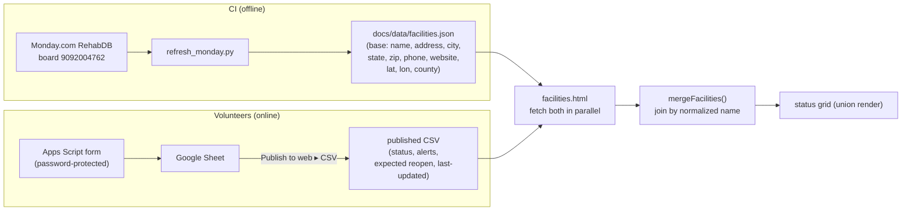
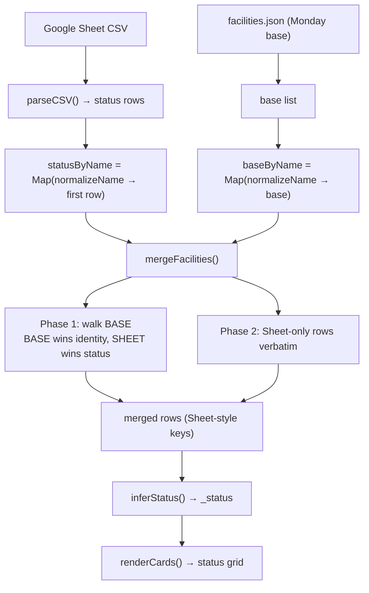
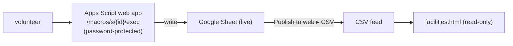

# Facility Status — Architecture & Maintainer Guide

> App: **Facility Status board** (`docs/facilities.html`)
> A single self-contained static page that shows the live open/limited/closed
> status of wildlife rehab facilities. Its defining trait is the
> **"Join-at-Read"** pattern: it fetches a Monday-sourced **base** dataset and a
> Google-Sheet **status** feed in parallel and merges them by normalized facility
> name **in the browser, at render time**.

---

## 1. Why "Join-at-Read"

Two different people own two different halves of the data:

- **Facility identity** (name, address, phone, website, county, lat/lon) is
  authoritative in **Monday.com (RehabDB board)** and is published by CI to
  `docs/data/facilities.json`.
- **Operational status** (Open/Limited/Closed/Call, alerts, expected reopen,
  last-updated) is volunteer-maintained in a **Google Sheet**, edited through a
  password-protected Apps Script form, and published as CSV.

Rather than pre-joining these into one file at build time, the page keeps them
independent and **joins them on every load** by normalized facility name. This
means a volunteer status edit shows up within ~5 minutes (CSV refresh) with no CI
run, and a Monday facility edit shows up on the next CI publish — the two cadences
stay decoupled.



---

## 2. File inventory

| Absolute path | Role |
| --- | --- |
| `/Users/P1/Projects/PA-Wildlife-Rehab/docs/facilities.html` | The **entire app**: inline `<style>`, body markup, inline `<script>` (~1395 lines). |
| `/Users/P1/Projects/PA-Wildlife-Rehab/docs/data/facilities.json` | **Base** facility dataset produced by CI from Monday RehabDB. Public (org addresses, not volunteer PII). |
| `/Users/P1/Projects/PA-Wildlife-Rehab/docs/data/facility_name_map.json` | **Build-time** join-key bridge (Monday abbreviation → full facility name). Used by `refresh_monday.py`, **not** by the page. See §4. |
| `/Users/P1/Projects/PA-Wildlife-Rehab/docs/assets/flags.js` | Shared maintenance-flag runtime. |
| Google Sheet "Publish to web" CSV | **Status** feed (`CSV_URL`, line ~916). |
| Google Apps Script web app | External password-protected submit form (line ~897). |

---

## 3. Page structure

`<body data-panel-key="page-facilities">` (line ~798).

| Section | Lines | Element / ID | `data-panel-key` |
| --- | --- | --- | --- |
| Advisory / disclaimer banner | 818–828 | `div.disclaimer-banner` | `facilities-disclaimer` |
| Search / filter controls | 830–852 | `div.controls-bar` | `facilities-controls` |
| Error banner | 854–857 | `#error-banner` / `#error-text` | — |
| Animal-code legend (collapsible) | 859–876 | `#legend-toggle` / `#legend-content` | — |
| Results count | 878–881 | `#results-count` | — |
| Status grid | 883–889 | `main#facilities-grid` (`aria-live="polite"`) | `facilities-grid` |
| Footer + submit-form link | 891–905 | `footer.site-footer`, `#last-refresh` | submit link: `facilities-submit-form` |

- **Advisory banner** (821–826): amber "!" + "Please Read" + *"This
  volunteer-maintained status may be out of date — use it as a guide only and
  always contact the facility directly to confirm before bringing an animal in
  for care."*
- **Controls** (830–852): `#search` (free text over name/county/alert),
  `#county-filter` `<select>` (populated dynamically), and a `.status-filters`
  button group with `data-status` values `""`/`open`/`limited`/`closed`/`call`.
- The grid first shows a `.loading-state` spinner, replaced once data arrives.

---

## 4. Data flow — the two feeds

Config constants (~916–918):

```js
const CSV_URL = 'https://docs.google.com/spreadsheets/d/e/2PACX-1vSyzu9RBr4suotvsDCChhkC67BRmmYZJqSQtbqj2awMEVpcdFbd8rNxkKQECQUOIz_aXtcy-agkN41P/pub?output=csv';
const FACILITIES_JSON_URL = 'data/facilities.json';
const REFRESH_INTERVAL_MS = 5 * 60 * 1000; // 5 minutes
```

Exactly **two** `fetch()` calls, run concurrently in `fetchData()` (~1254) via
`Promise.all` (~1273). Both URLs are cache-busted with `?_=<Date.now()>`.

- **Fetch A — STATUS (required):** `fetch(CSV_URL + &_=…)` (~1275). On `!res.ok`
  it throws; on success it strips the UTF-8 BOM.
- **Fetch B — BASE (best-effort):** `fetch('data/facilities.json?_=…')` (~1282),
  wrapped in try/catch — on any failure it logs a warning and returns `[]`, so
  the page **still renders from Sheet data alone**.

### Field provenance

| Field | Source | Consumed in |
| --- | --- | --- |
| name, address, city, state, zip, phone, website, county | **BASE** `facilities.json` (`b.name` etc.) | `mergeFacilities` (~1222) |
| Status, Status Notes, Alerts, Expected Reopen Date, Last Updated | **SHEET** CSV | `inferStatus` (~1007), `renderCards` (~1057) |
| Contact Person, Animals Accepted | **SHEET** only (carried through) | `renderCards` |

> **Note on lat/lon:** `facilities.json` carries `lat`/`lon` (Monday already has
> them), but `facilities.html` **does not consume coordinates** — the merge copies
> only the eight base fields above, and the per-card map button is built from the
> joined **address string** (P.O.-box addresses suppress the button). lat/lon are
> there for future use.

After fetch, `processData(csvText, baseList)` (~1301) parses the CSV, merges,
stamps each row with `_status`, and rebuilds the county dropdown. Auto-refresh:
`setInterval(fetchData, REFRESH_INTERVAL_MS)` (~1392).

### The join key — primary + fallback

- **Primary join key** = the facility **name**. On the BASE side that is `b.name`
  = the Monday RehabDB **"Facility Name"** column, whose Monday column id is
  **`text_mm4esfft`**. On the SHEET side it is the `Facility Name` column.
- **Fallback (build-time only):** when a RehabDB row's `text_mm4esfft` is empty,
  `refresh_monday.py` resolves the canonical `name` it writes into
  `facilities.json` using, in order: `facility_name_map.json` → an
  Availability-parsed name → the board's `Rehab Name` item title. By the time the
  browser joins, `facilities.json` already carries a single canonical `name`, so
  **the page itself only ever does normalized-name equality** — it has no
  knowledge of the name-map. (As the "Facility Name" column gets fully populated
  in Monday, `facility_name_map.json` becomes unused with no code change.)

---

## 5. The join logic (browser, at read time)

### Normalization — `normalizeName()` (~932)

```js
function normalizeName(name) {
  return String(name || '')
    .toLowerCase()
    .replace(/[^a-z0-9]+/g, ' ')  // punctuation + whitespace runs → single space
    .replace(/\s+/g, ' ')
    .trim();
}
```

So `"AARK Wildlife Rehab. & Education Center, Inc."` and
`"aark wildlife rehab education center inc"` collapse to the same key. Blank names
normalize to `''` and never join.

### Merge — `mergeFacilities(baseList, statusRows)` (~1198)

A documented **union join** in three phases. First build two `Map`s keyed by
normalized name (the SHEET map keeps the **first** row per key, a deterministic
dedupe when a facility is listed twice):

```js
const statusByName = new Map();
statusRows.forEach(r => {
  const key = normalizeName(r['Facility Name']);
  if (key && !statusByName.has(key)) statusByName.set(key, r);
});
const baseByName = new Map();
(baseList || []).forEach(b => {
  const key = normalizeName(b.name);
  if (key) baseByName.set(key, b);
});
```

**Phase 1 — walk BASE (Monday wins base fields).** Start from the matched Sheet
row (so Status/Notes/Alerts/Reopen/Updated/Contact/Animals survive), then BASE
overwrites the eight identity fields:

```js
baseByName.forEach((b, key) => {
  const s = statusByName.get(key);
  if (s) usedStatusKeys.add(key);
  const row = s ? { ...s } : {};        // Monday-only → empty status object
  row['Facility Name'] = b.name || row['Facility Name'] || '';
  row['Address'] = b.address || '';
  row['City']    = b.city || '';
  row['State']   = b.state || '';
  row['Zip']     = b.zip || '';
  row['Phone']   = b.phone || '';
  row['Website'] = b.website || '';
  row['County']  = b.county || row['County'] || '';
  out.push(row);
});
```

**Phase 2 — Sheet-only rows** (no Monday base) are pushed verbatim, using Sheet
data as their own base:

```js
statusByName.forEach((s, key) => {
  if (!usedStatusKeys.has(key)) out.push({ ...s });
});
```

**Phase 3 — diagnostics** (console only): logs Monday-only names (rendered with
empty status) and Sheet-only names (rendered from Sheet base data).

**Resulting semantics:**

- **Matched:** BASE wins identity fields; SHEET wins status fields; Sheet-only
  columns (Contact, Animals) carried.
- **Sheet-only:** rendered entirely from Sheet data.
- **Monday-only:** rendered from BASE with an empty status object.

The merge emits Sheet-style column keys (`'Facility Name'`, `'Address'`, …) so
`renderCards` is source-agnostic.



> **Caveat for maintainers:** `inferStatus()` (~1007) defaults a row with no
> Status/Notes to `'open'`. So a **Monday-only** facility (no Sheet match)
> actually renders as **Open**, not visually blank — keep this in mind when a new
> facility appears "Open" before any volunteer has set its status.

---

## 6. Status rendering

`inferStatus(row)` (~1007) resolves to `open | limited | closed | call`:

1. Explicit `Status` column (case-insensitive) wins.
2. Else infer from `Status Notes` keywords: "closed"/"temporarily closed" →
   `closed`; "limited"/"appointment only"/"currently accepting" → `limited`; else
   `open`.

Applied in `processData`:
`allFacilities = merged.map(r => ({ ...r, _status: inferStatus(r) }))`.

Color is **CSS-driven** off the `status-<value>` class on each card
(`renderCards` ~1088): left-border + badge colors green/amber/red/blue for
open/limited/closed/call. `STATUS_LABELS` maps the slug to display text.

**Card contents** (`renderCards` ~1036): collapsed summary (name + status badge,
county tag, optional Animals tag, optional Last-Updated tag, optional `.card-alert`
banner from `Alerts`/`Alert`, "Tap for details"); expandable details (status
note, address + Google Maps button unless P.O. box, `tel:` links split on `;`/`,`,
website hostname link, contact person, expected reopen, last updated). Expand via
`toggleCard`/`keyToggle`.

> **Known cosmetic bug:** the status-pill active-state ternary (~1374) maps any
> non-empty/open/limited value to `active-closed`, so the **"Call" filter pill
> shows closed (red) styling when active**. Filtering still works correctly; only
> the active-pill color is wrong.

---

## 7. CSV parsing

`parseCSV(text)` (~941) + `parseLine(line)` (~983) implement an RFC-4180-style
parser: strips BOM, tracks `inQuotes` so `\n`/`\r` inside quotes don't split
rows, handles `\r\n` and doubled `""` escapes. Row 0 → headers; remaining rows →
objects keyed by trimmed headers; a final filter keeps only rows with a
`Facility Name` or `County`.

---

## 8. The Apps Script submit form (write path)

In the footer (~897–903):

```html
<p ... data-panel-key="facilities-submit-form">
  <a href="https://script.google.com/macros/s/AKfycby…U7bAfNvS65mgVdtHHu7/exec"
     target="_blank" rel="noopener">
    Update Facility Status &rarr;
  </a>
</p>
```

- It is a **plain external link** to a deployed Google Apps Script web app
  (`/macros/s/<DEPLOYMENT_ID>/exec`). **Not** an iframe, no inline form logic.
- The volunteer-facing form, the **password gate**, and the **write to the live
  Google Sheet all live inside the Apps Script deployment** — none of it is in
  this repo. `facilities.html` is strictly **read-only** w.r.t. the data (config
  comment ~909: *"The Apps Script submit form + the Sheet write path are
  untouched: this page only READS both sources."*).
- `flags.js` can dim/disable the link via `data-panel-key="facilities-submit-form"`.



---

## 9. Maintenance recommendations

**What breaks (and how to tell):**

| Symptom | Likely cause | Fix |
| --- | --- | --- |
| Whole grid empty / error banner | CSV un-published or URL rotated (CSV fetch is required) | Re-publish the Sheet; update `CSV_URL` (~916). |
| A facility shows no address/phone but has status | Name mismatch → no BASE join | Align the Monday "Facility Name" (`text_mm4esfft`) with the Sheet `Facility Name`, or add an entry to `facility_name_map.json` (build-time fallback) and re-run CI. |
| A facility shows address but status "Open" with no notes | Monday-only row (no Sheet match) → `inferStatus` defaults to open | Have a volunteer add it to the Sheet, or accept the Open default. |
| New facility missing entirely | Not in either source | Add to Monday RehabDB (publishes via CI) and/or the Sheet. |
| "Call" filter pill looks red | Known cosmetic ternary bug (~1374) | Optional fix; filtering is unaffected. |
| Page dimmed with a banner | `flags.js` has `page-facilities` in `maintenance` | Edit `PAGES['page-facilities']` in `assets/flags.js`. |
| Submit link 404 / asks for password unexpectedly | Apps Script redeployed (new `/exec` id) or its password changed | Update the `href` (~898); the form/password live in Apps Script, not here. |

**How the two cadences interact:** status edits propagate in ~5 minutes (CSV
refresh, no CI). Identity edits (address/phone/new facility from Monday)
propagate on the next CI publish of `facilities.json` (gated by the VolDB_Status
sentinel — see `ARCHITECTURE_SYSTEM.md`). If a Monday change isn't showing,
confirm CI ran and committed `docs/data/facilities.json`.

**How to extend:**

- **New base field on cards** → add it to `facilities.json` (via
  `refresh_monday.py`) and copy it through in `mergeFacilities` (~1217), then
  render it in `renderCards`.
- **New status keyword mapping** → extend `inferStatus` (~1007).
- **Restyle** → all CSS inline at the top of the file (`.facility-card.status-*`,
  `.status-badge`, `.card-alert`).

**Security:** all rendered values pass through `escapeHTML` (~1028) — the CSV is
user-submitted; preserve escaping on any new render path. The page never writes
data; all writes are gated by the external Apps Script password.

**Dependencies:** Google Sheets published CSV, `docs/data/facilities.json` (CI),
optional `facility_name_map.json` (build-time), Google Apps Script web app,
`assets/flags.js`. No JS/CSS libraries.
