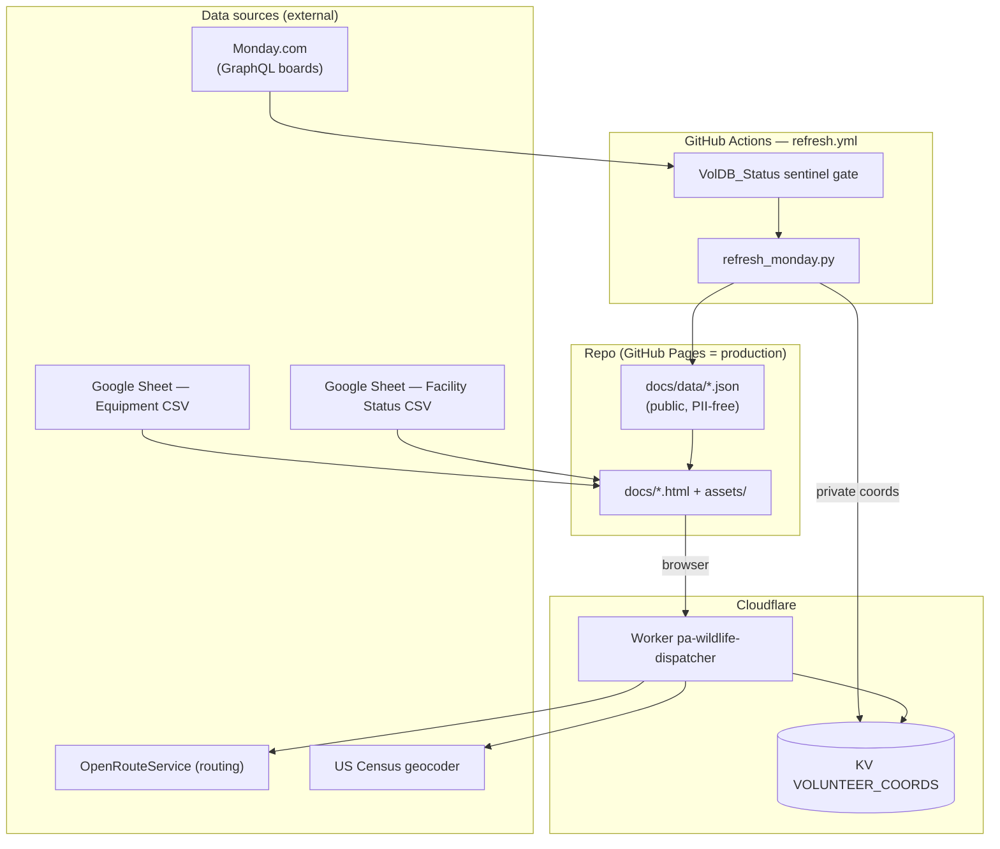
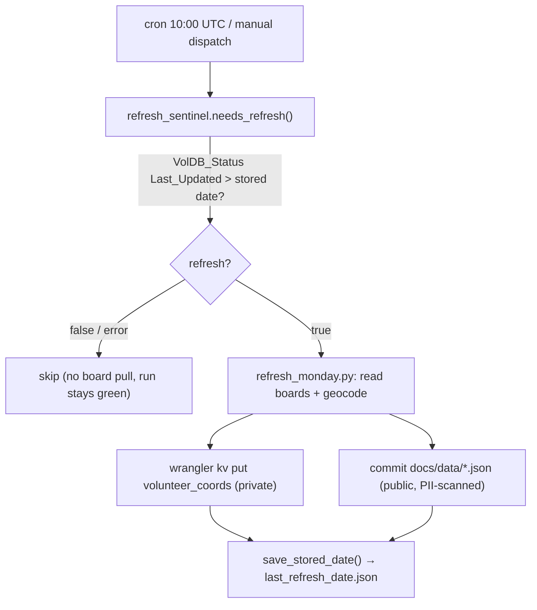

# WIN Volunteer Apps — Cross-Cutting System & Maintainer Guide

> Scope: the shared infrastructure behind the three apps — Equipment Transfers,
> Dispatch Helper, and Facility Status. Read the per-app docs alongside this:
> `ARCHITECTURE_EQUIPMENT.md`, `ARCHITECTURE_DISPATCHER.md`,
> `ARCHITECTURE_FACILITIES.md`.
>
> Repo: **github.com/wildlifeinneed/winstat** · default branch **main**.

---

## 1. System overview



Three independent static pages share one asset folder, one CI refresh pipeline,
one Worker, and one flag system. Everything the public sees is static files on
GitHub Pages; the only dynamic, private layer is the Cloudflare Worker + KV used
by the dispatcher.

---

## 2. Build system: pure static, no framework

- **No framework, no bundler, no `npm` build for the site.** Each page is plain
  HTML + inline CSS + vanilla JS, plus a few shared scripts in `docs/assets/`
  (`flags.js`, `messages.js`, `decision.js`, and the dispatcher's
  `dispatcher.js`). Leaflet is **vendored** under
  `docs/assets/vendor/leaflet/` so nothing depends on a CDN at runtime.
- **Production = GitHub Pages**, served from the `docs/` folder of `main`
  (`https://wildlifeinneed.github.io/...`). Pushing to `main` deploys.
- **Preview = Cloudflare Pages** (`*.pages.dev`) for dev previews. The flag system
  (`flags.js`) detects which environment it is in by hostname.
- The only thing that *is* built/deployed separately is the **Worker** (Wrangler,
  in `worker/`).

Implication: to change any page, edit the file and push. There is no compile
step to break, no lockfile to reconcile for the site itself.

---

## 3. CI/CD — `.github/workflows/refresh.yml`

Purpose: keep the committed `docs/data/*.json` aggregates and the private KV
volunteer coords current from Monday.com, **cheaply** (only when the tracker
advances) and **safely** (never leaking PII).

Triggers: `schedule: cron '0 10 * * *'` (10:00 UTC daily; ~06:00 ET in summer,
05:00 ET in winter) and `workflow_dispatch` (manual). `permissions: contents: write`.

Two jobs:

**Job `refresh` (capacity snapshot):**
1. Checkout (`fetch-depth: 0`), set up Python 3.11, `pip install -r requirements.txt`.
2. `python3 refresh_monday.py --if-stale` with `MONDAY_API_TOKEN` from secret
   `MONDAY_TOKEN`.
3. If `docs/data/county_capacity.json` or `docs/data/.last_remote_update`
   changed: commit as `wildlife-dispatcher-bot` and **pull --rebase then push**
   (retry up to 5×).

**Job `refresh-dispatcher-data` (full datasets + KV push):**
1. Checkout, Python 3.11, **Node 20** (for Wrangler), install deps.
2. **Sentinel gate** (`refresh_sentinel.needs_refresh`) → writes
   `refresh=true|false` to `$GITHUB_OUTPUT`. Fail-safe: any Monday error returns
   `false` (no expensive pull, never crashes the run).
3. If `refresh==true`: `python3 refresh_monday.py` (full board pull + geocode).
4. **Push private coords to KV:** `npx wrangler@3 kv key put
   --namespace-id=43bdd5e237544683b20cdbc61d42dd49 volunteer_coords
   --path=data/volunteer_coords.json` (auth via `CLOUDFLARE_API_TOKEN` secret +
   `CLOUDFLARE_ACCOUNT_ID`). Aborts if the coords file is missing.
5. **Commit ONLY public aggregates** with a defence-in-depth PII guard (see §8).
6. Update the gitignored stored sentinel date so the next run can compare.

### Required secrets / env

| Name | Where | Used for |
| --- | --- | --- |
| `MONDAY_TOKEN` (→ `MONDAY_API_TOKEN`) | repo secret | Monday GraphQL reads (both jobs + sentinel). |
| `CLOUDFLARE_API_TOKEN` | repo secret | `wrangler kv key put` to push coords. |
| `CLOUDFLARE_ACCOUNT_ID` | inlined in workflow (`290463cfd0bc273076e8c62678f7c845`) | Cloudflare account for the KV push. |

> No secret is committed. The KV namespace id and account id are non-secret
> binding values and live in `worker/wrangler.toml` / the workflow.

---

## 4. Data refresh pipeline — `refresh_monday.py`

A single Python script (~1957 lines) that is the **ground truth** for all
Monday-derived data. It reads boards via Monday GraphQL, geocodes addresses, and
writes both public aggregates and the private coords file.

**Monday boards read:**

| Board | ID | Produces |
| --- | --- | --- |
| Connecteam_Users (volunteers) | `9092079933` | per-county role capacity → `county_capacity.json`; geocoded coords → `volunteer_coords.json` |
| RehabDB (rehabbers/facilities) | `9092004762` | `rehabbers.json` (public) + `facilities.json` (base for facilities.html) |
| Area Coordinators | `18416913502` | `coordinators.json` (area → coordinator name) |
| VolDB_Status (tracker) | `6750158385` | the staleness sentinel (group "VolunteerDB Last Update", column "Last_Updated") |

**Outputs (relative paths in the script):**

| Constant | Path | Visibility |
| --- | --- | --- |
| `OUTPUT_REL_PATH` | `docs/data/county_capacity.json` | public, committed |
| `REHABBERS_REL_PATH` | `docs/data/rehabbers.json` | public, committed |
| `FACILITIES_REL_PATH` | `docs/data/facilities.json` | public, committed |
| `FACILITY_NAME_MAP_REL_PATH` | `docs/data/facility_name_map.json` | public, committed (build-time join bridge) |
| `COORDINATORS_REL_PATH` | `docs/data/coordinators.json` | public, committed |
| `SIDECAR_REL_PATH` | `docs/data/.last_remote_update` | committed marker of last remote update |
| `COORDS_REL_PATH` | `data/volunteer_coords.json` | **PRIVATE, gitignored → KV only** |

**Facility name resolution (for `facilities.json`):** primary key is the RehabDB
"Facility Name" column `text_mm4esfft`; when empty, fall back to
`facility_name_map.json`, then an Availability-parsed name, then the board item
title `Rehab Name`. The browser then joins by normalized name at read time (see
`ARCHITECTURE_FACILITIES.md`).

**`--if-stale` flag:** lets the cheap `refresh` job skip work unless the tracker
advanced.

### VolDB_Status sentinel — `refresh_sentinel.py`

A thin wrapper over `refresh_monday`'s Monday client. It answers one question:
*"has the VolDB_Status tracker advanced since our last full refresh?"*

- Reads board `6750158385`, group "VolunteerDB Last Update", column
  "Last_Updated", takes `MAX(Last_Updated)` (reuses
  `refresh_monday.fetch_remote_last_updated`).
- Compares against a **gitignored** stored date file
  `last_refresh_date.json` (`DEFAULT_STORED_PATH`, `{"last_updated":"YYYY-MM-DD"}`).
- Rules: missing stored date → refresh; sentinel strictly newer → refresh; equal
  or older → skip. **Fail-safe:** any API/parse error → `False` (never refresh,
  never raise).



---

## 5. The Worker — `worker/`

The dispatcher's private layer. Holds volunteer coords in KV and returns only
PII-free aggregates. **Deployed and live** at
`https://pa-wildlife-dispatcher.winstat.workers.dev` (some in-file comments still
say "scaffold/not deployed" — those are stale; see `worker/README.md`, which is
authoritative).

| File | Role |
| --- | --- |
| `worker/wrangler.toml` | Deploy config: `name`, `main=src/index.mjs`, `account_id`, `[vars] ALLOWED_ORIGIN`, KV binding `VOLUNTEER_COORDS`. No secrets. |
| `worker/src/index.mjs` | Cloudflare ESM entry — thin wrapper that supplies real `env`/`fetch` to the handler. |
| `worker/src/handler.js` | Pure request handler: param parsing (query + JSON/POST body), CORS, KV read, route dispatch, error mapping. |
| `worker/src/aggregate.js` | Port of the Python `find_volunteers_in_radius` (haversine, radius clamp, role counting, context rows). |
| `worker/src/census.js` | US Census geocode helper (injectable `fetch`). |
| `worker/src/autocomplete.js` | Photon autocomplete proxy (+ Census fallback). |
| `worker/src/distance.js` | ORS Matrix driving-distance calls (`rehabberDistances`). |
| `worker/src/pip.js` / `county_win.js` | Point-in-polygon county lookup + county→WIN-area, using the **same** committed `docs/data/pa_counties.json` as the frontend. |

**Routes** (all on the Worker root; selected by params, see `handler.js`):

| Request | Behavior |
| --- | --- |
| `?address=…&radius_mi=…` or `?animal_lat=&animal_lon=&radius_mi=` | Aggregate: geocode (Census, if address) → read KV coords → count qualifying volunteers in radius → PII-free JSON. |
| `?mode=rehabber_distances` (POST `{origin,destinations}`) | ORS driving distances for the public rehabber panel. Degrades to haversine if `ORS_API_KEY` unset (`duration_min:null`). |
| `?autocomplete=<q>&limit=` | Photon address suggestions (Census fallback). |
| `OPTIONS` | CORS preflight. |

**Build/deploy (Wrangler):**

```bash
cd worker
wrangler deploy          # account_id, KV binding, ALLOWED_ORIGIN already in wrangler.toml
wrangler secret put ORS_API_KEY   # ORS key is a SECRET, never in [vars]
```

Only `CLOUDFLARE_API_TOKEN` is supplied via the environment at deploy time.

**CORS — `ALLOWED_ORIGIN`:** a comma-separated allowlist in `[vars]`, currently
`https://wildlifeinneed.github.io,https://*.pages.dev`. `resolveAllowedOrigin()`
echoes back whichever listed origin the request actually came from (with `*`
matching only within the host portion); unknown/no-Origin falls back to the first
entry (production). **If the site origin ever changes, update this var and
redeploy or the browser will get CORS errors.**

---

## 6. KV store — `VOLUNTEER_COORDS`

- Namespace id `43bdd5e237544683b20cdbc61d42dd49`, binding name
  `VOLUNTEER_COORDS`, single key **`volunteer_coords`** (a JSON array of volunteer
  coordinate/role records — the PII the browser must never see).
- **Written only by CI** (`refresh-dispatcher-data` job) via
  `wrangler kv key put … --path=data/volunteer_coords.json`.
- **Read only by the Worker** (`handler.js`, `KV_COORDS_KEY = 'volunteer_coords'`).
- The browser never reads KV; it only ever receives the aggregate.

---

## 7. Flag system — `docs/assets/flags.js`

Single source of truth for per-page maintenance state. Pages and home-page cards
carry `data-panel-key` attributes; `flags.js` reads them and applies a state.

- **Page keys:** `page-equipment`, `page-dispatcher`, `page-facilities` (the
  `<body data-panel-key="page-…">`), plus per-page sub-panel keys
  (`equipment-controls`, `dispatcher-county-mode`, `facilities-grid`, …).
- **States:** `live`, `maintenance` (wrapper stays but is dimmed
  `.is-under-maintenance` + a single banner), `hidden`. Each key maps
  `{ prod: <state>, dev: <state> }`.
- **Environment detection (hostname):** `*.pages.dev → 'dev'`;
  `wildlifeinneed.github.io` (and anything else, incl. `file://`) `→ 'prod'`
  (`resolveEnv`).
- **Runtime:** `applyPanelFlags()` resolves the page wrapper's state for the
  current env and dims/hides it; `applyCardSync()` lets the home page's tool
  cards mirror a target page's maintenance state **before** navigation.

To put a page under maintenance in production only:

```js
'page-dispatcher': { prod: 'maintenance', dev: 'live' }
```

---

## 8. Branch strategy & PII safety (read before you push)

- **Single primary branch: `main`.** GitHub Pages serves `docs/` from `main`, so
  a push to `main` is a production deploy. Cloudflare Pages builds previews from
  branches/PRs (`*.pages.dev`).
- **CI commits to `main`** as `wildlife-dispatcher-bot`. Both commit steps do
  `git pull --rebase origin main && git push` with up-to-5 retries.
- **Recommended discipline: always `git pull --rebase` before you push.** Because
  CI auto-commits the refreshed `docs/data/*.json`, your local `main` is
  frequently behind. Pushing without rebasing risks rejected pushes or, worse,
  reverting a bot refresh. Treat `docs/data/*.json` as **bot-owned**; avoid
  hand-editing them.
- **PII guard (defence-in-depth in CI, do not weaken):** the dispatcher-data
  commit step (a) `git add`s only an explicit public allow-list
  (`county_capacity.json`, `.last_remote_update`, `rehabbers.json`,
  `coordinators.json`, `facilities.json`, `facility_name_map.json`); (b) asserts
  the staged diff is a subset of that allow-list and that `data/volunteer_coords.json`
  is never staged; (c) scans added lines in the rehabber/coordinator files for
  PII-shaped keys (`phone/email/address/zip/...`) and aborts the push if any
  appear. `facilities.json` is intentionally excluded from the key-scan (public
  facility addresses are expected), but is still subject to the allow-list.

---

## 9. Dependency inventory

| Dependency | Tier | Auth | Notes |
| --- | --- | --- | --- |
| Monday.com GraphQL | CI (build-time) | `MONDAY_TOKEN` secret | Source of volunteers, rehabbers, facilities, coordinators, tracker. |
| Google Sheets "Publish to web" CSV | Browser | none | Equipment board + Facility status feeds. URL rotation = silent breakage. |
| Google Apps Script web app | Browser link | password (in Apps Script) | Facility status submit/write path. External to repo. |
| US Census geocoder | Worker | **no API key** | Address → lat/lon. Proxied through Worker (CORS). |
| Photon | Worker | none | Address autocomplete (Census fallback). |
| OpenRouteService (ORS) Matrix | Worker | `ORS_API_KEY` (Worker secret) | Driving distances; **free tier**, graceful haversine fallback if unset/over-quota. |
| OpenStreetMap tiles | Browser | none | Leaflet basemap (dispatcher only). |
| Leaflet | Browser | n/a | **Vendored** in `docs/assets/vendor/leaflet/` (no CDN). |
| Cloudflare Worker + KV | Edge | `CLOUDFLARE_API_TOKEN` | Private dispatcher layer. |

---

## 10. Monitoring checklist

Run through this periodically, and after any origin/credential change:

- [ ] **CI green.** The `refresh.yml` runs are passing (check the latest
      scheduled run). A red run usually means a Monday token or rate-limit issue.
- [ ] **KV data age.** Confirm CI actually pushed `volunteer_coords` recently
      (the dispatcher address mode degrades if KV is empty/stale). Cross-check
      against the latest "Auto-refresh dispatcher data" commit.
- [ ] **Monday freshness.** VolDB_Status "Last_Updated" should advance when the
      volunteer DB changes; if it's stuck, CI will (correctly) skip refreshes and
      data will go stale silently.
- [ ] **Worker CORS after any origin change.** If the site moves (new Pages
      domain, custom domain, new preview pattern), update `ALLOWED_ORIGIN` in
      `worker/wrangler.toml` and `wrangler deploy`, then confirm the dispatcher's
      address mode works from that origin.
- [ ] **ORS key health.** If rehabber distances are always "(est.)", the
      `ORS_API_KEY` secret is unset/expired or over quota — re-set it. Non-urgent
      (panel still works straight-line).
- [ ] **CSV feeds live.** Open both published CSV URLs (Equipment + Facilities) in
      a plain browser tab; a redirect/login page means the Sheet was unpublished
      or re-shared.
- [ ] **Pages deploy.** A push to `main` should reflect on
      `wildlifeinneed.github.io` within a minute or two.

---

## 11. Repo orientation (where things live)

```
PA-Wildlife-Rehab/  (→ github.com/wildlifeinneed/winstat)
├── docs/                      # GitHub Pages root (production)
│   ├── index.html             # home (tool cards reflect flags)
│   ├── equipment-transfers.html
│   ├── dispatcher.html
│   ├── facilities.html
│   ├── assets/
│   │   ├── flags.js           # maintenance flag runtime
│   │   ├── messages.js        # WildlifeMessages (wording/thresholds)
│   │   ├── decision.js        # WildlifeDecision (qualification logic)
│   │   ├── dispatcher.js      # dispatcher app logic
│   │   └── vendor/leaflet/    # vendored Leaflet
│   └── data/                  # public, PII-free JSON (bot-owned)
│       ├── county_capacity.json  rehabbers.json  coordinators.json
│       ├── facilities.json       facility_name_map.json  county_win.json
│       └── pa_counties.json   # shared by frontend AND Worker
├── refresh_monday.py          # CI: Monday → datasets (ground truth)
├── refresh_sentinel.py        # CI: VolDB_Status staleness gate
├── requirements.txt
├── worker/                    # Cloudflare Worker (dispatcher private layer)
│   ├── wrangler.toml  README.md  src/{index.mjs,handler.js,aggregate.js,census.js,...}
├── data/volunteer_coords.json # PRIVATE, gitignored → KV only
└── .github/workflows/refresh.yml
```
