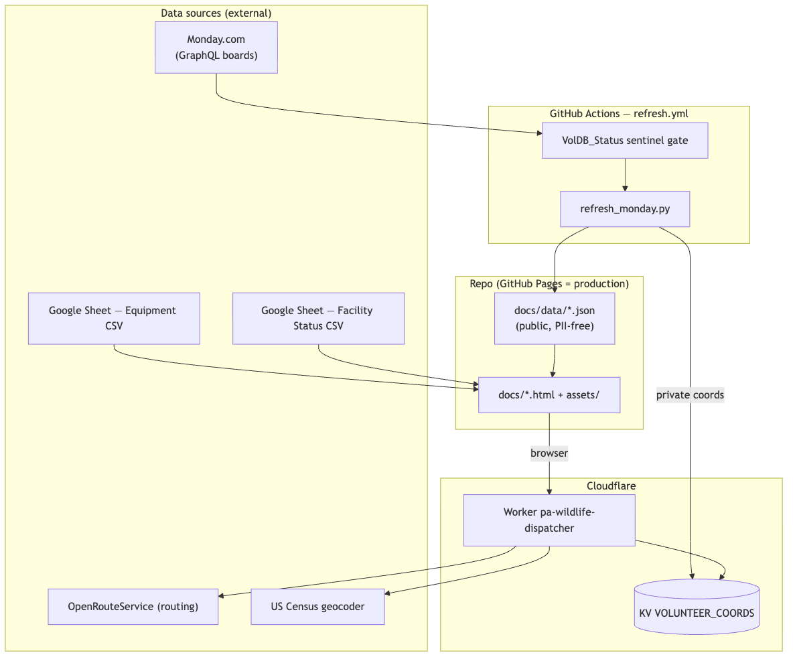
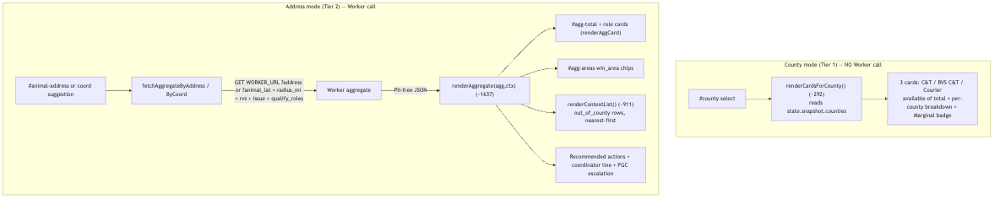
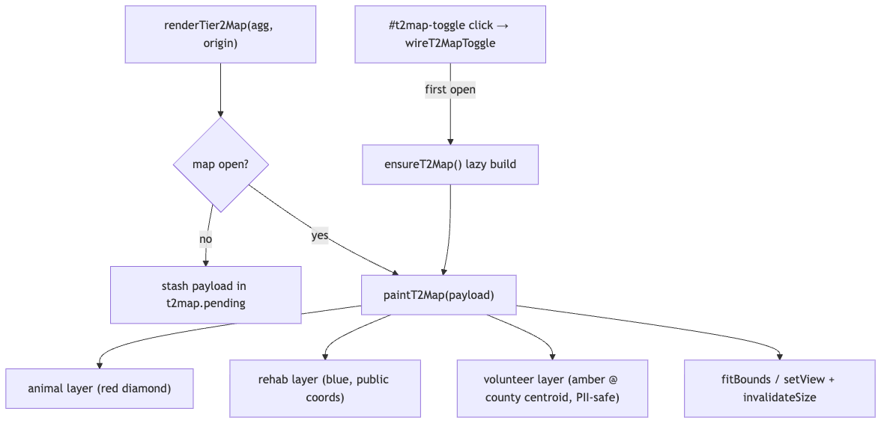
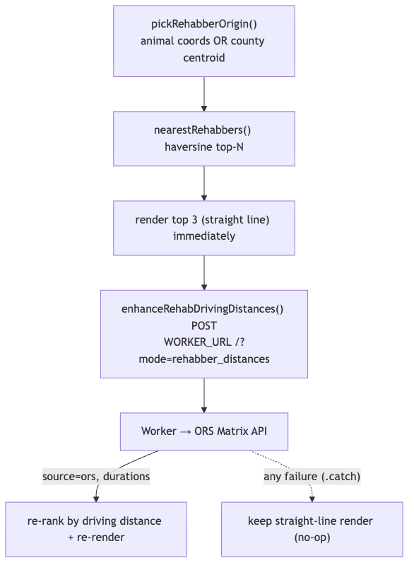
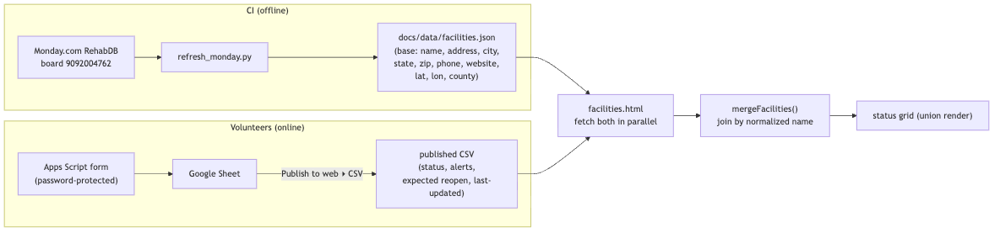
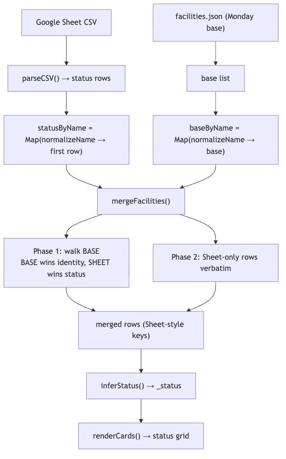
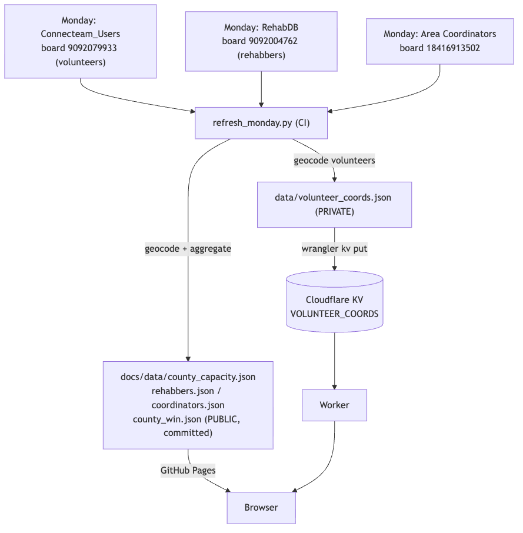
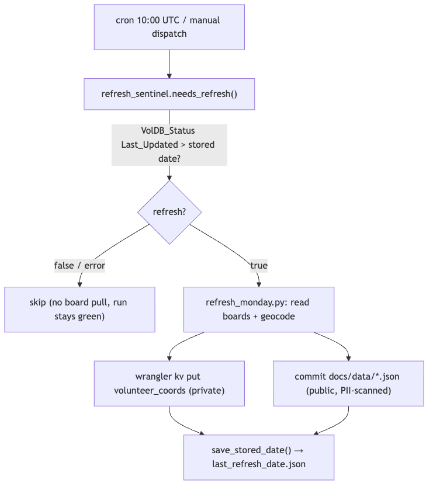
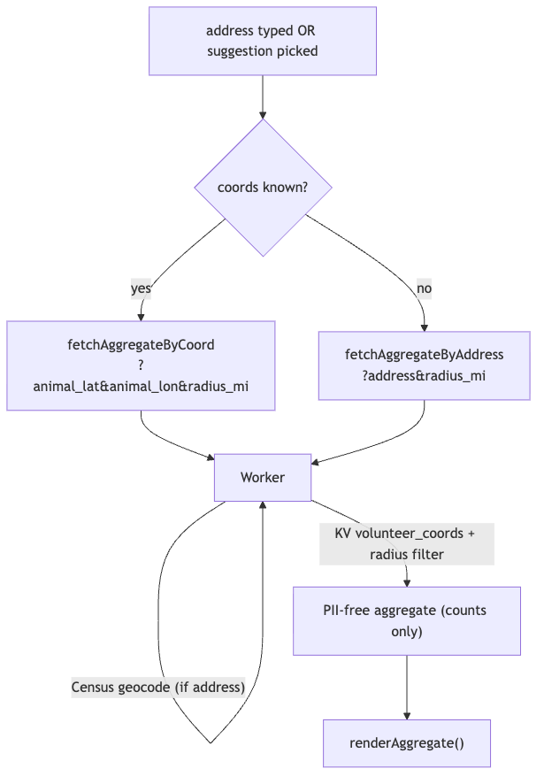

# Glossary — WIN Volunteer Apps Architecture Docs

> Plain-English definitions of the jargon, abbreviations, and product-specific
> terms used across `ARCHITECTURE_EQUIPMENT.md`, `ARCHITECTURE_DISPATCHER.md`,
> `ARCHITECTURE_FACILITIES.md`, and `ARCHITECTURE_SYSTEM.md`.
>
> Audience: a volunteer coder who knows general programming but may be new to
> Cloudflare, Monday.com, and the WIN-specific wiring. Each entry is intentionally
> short — read the linked architecture doc for the full story.

---

## Cloudflare terms

- **Cloudflare** — A cloud platform whose services (Workers, KV, Pages) run on
  Cloudflare's globally distributed network rather than on one central server.
- **Worker** — A small JavaScript program that runs on Cloudflare's servers and
  responds to web requests; in this project it is the private layer that reads
  volunteer coordinates and returns only PII-free aggregate counts.
  See: 
- **KV (KV store)** — Cloudflare "Key-Value" storage: a simple cloud database
  that stores values looked up by a key. Here it holds the private
  `volunteer_coords` data that the browser must never see.
- **Cloudflare Pages** — Cloudflare's static-site hosting; used here only for
  **preview/dev** builds served from `*.pages.dev` URLs.
- **wrangler** — Cloudflare's command-line tool for configuring and deploying
  Workers and pushing data into KV (e.g. `wrangler deploy`,
  `wrangler kv key put`).
- **wrangler.toml** — The Worker's configuration file (name, entry point,
  account id, KV binding, allowed origins). Contains no secrets.
- **KV binding** — The name (e.g. `VOLUNTEER_COORDS`) that lets the Worker's code
  reach a specific KV store without hardcoding its raw id.
- **namespace id** — The unique identifier of a specific KV store; it is a
  non-secret binding value, not a password.
- **account_id / CLOUDFLARE_ACCOUNT_ID** — The non-secret identifier of the
  Cloudflare account that owns the Worker and KV.
- **ALLOWED_ORIGIN** — A Worker config variable listing which website origins are
  allowed to call the Worker (the CORS allowlist). If the site's URL changes,
  this must be updated and the Worker redeployed.
- **edge compute / edge function** — Running code (like a Worker) on servers
  geographically close to the user ("the edge") instead of one central data
  center, for lower latency.
  See: 

## Monday.com terms

- **Monday.com** — A cloud work-management platform used here as the source of
  truth for volunteers, rehabbers, facilities, and coordinators data.
- **board** — A Monday.com data table (similar to a spreadsheet/database table);
  each project board has a numeric ID (e.g. `9092004762`).
- **item** — A single row/record on a Monday board (e.g. one facility or one
  volunteer); an item has a title and a set of column values.
- **column ID** — Monday's internal, machine name for a column, which differs
  from its human label. Example: the "Facility Name" column's id is
  `text_mm4esfft`; code must reference the id, not the label.
- **GraphQL API** — Monday's query interface where you ask for exactly the fields
  you want in a single structured request (see **GraphQL** below). The refresh
  pipeline reads all board data through it.

## GitHub terms

- **GitHub Pages** — GitHub's free static-website hosting; **production** here is
  served from the `docs/` folder of the `main` branch, so pushing to `main`
  deploys the site.
- **GitHub Actions** — GitHub's built-in automation/CI system that runs scripts
  on a schedule or on demand (used here to refresh data).
- **workflow** — A single GitHub Actions automation defined by a YAML file (e.g.
  `.github/workflows/refresh.yml`); it contains one or more jobs of steps.
- **workflow_dispatch** — A trigger that lets a maintainer run a workflow
  manually from the GitHub UI (as opposed to the scheduled `cron` trigger).
- **secrets** — Encrypted values (like API tokens) stored in the repo's GitHub
  settings and injected into Actions at runtime; never committed to the code.

## WIN domain abbreviations

- **WIN** — Wildlife In Need; the volunteer organization these apps serve. Also
  used in "WIN area," a region grouping multiple counties.
- **winstat** — The name of the GitHub repository
  (`github.com/wildlifeinneed/winstat`) that holds all three apps.
- **pawr / PA-Wildlife-Rehab** — Short names for this project / its local
  directory (Pennsylvania Wildlife Rehab).
- **ORS** — OpenRouteService, a free routing provider used (via the Worker) to
  compute real driving distances between an animal's location and rehabbers.
- **RVS** — Rabies-Vector Species; whether an animal can carry rabies, which
  changes which volunteer roles are qualified to handle it.
- **C&T** — Capture & Transport; a volunteer role qualified to both capture and
  move an animal (non-rabies). Appears as `ct_no_rvs` in data.
- **RVS C&T** — Capture & Transport for rabies-vector species; the rabies-trained
  variant of the C&T role.
- **COURIER / Courier** — A volunteer role qualified to transport (but not
  capture) an animal.
- **VOLDB / VolDB_Status** — The "Volunteer DB" status tracker board on Monday
  whose `Last_Updated` date tells CI whether anything changed (the staleness
  sentinel).
- **RehabDB** — The Monday board that holds rehabber/facility identity records
  (name, address, phone, county, lat/lon).
- **Tier 1 / Tier 2** — The dispatcher's two search modes: **Tier 1** is the fast
  county-level capacity overview; **Tier 2** is the precise address + radius
  search that calls the Worker and draws the map.
  See: 

## General web/technical terms

- **CI (Continuous Integration)** — An automated build/test/deploy pipeline that
  runs whenever code changes, so checks and refreshes happen without manual steps.
- **CORS (Cross-Origin Resource Sharing)** — Browser security rules that block a
  web page from calling a different domain unless that domain explicitly allows
  it. The Worker proxies third-party services so the browser only ever talks to
  one allowed origin.
- **CORS preflight** — An automatic `OPTIONS` request the browser sends first to
  check whether a cross-origin call is permitted before sending the real request.
- **CDN (Content Delivery Network)** — A network of servers that delivers files
  from a location near the user. This project deliberately avoids CDNs by
  **vendoring** Leaflet locally.
- **GraphQL** — A query language for APIs where the client specifies exactly which
  fields it needs in one request, instead of hitting many fixed endpoints.
- **Leaflet** — An open-source JavaScript library for interactive maps; used here
  to render the dispatcher volunteer map.
  See: 
- **npm (Node Package Manager)** — The JavaScript package manager used to install
  the project's dependencies and run its scripts.
- **OSM (OpenStreetMap)** — Free, community-built map data used as the tile source
  for the dispatcher map.
- **geocode** — Convert a street address into latitude/longitude coordinates
  (done server-side via the US Census geocoder).
- **haversine** — A formula for straight-line ("as the crow flies") distance
  between two lat/lon points; used as a fast first pass before ORS driving
  distances.
  See: 
- **IIFE** — Immediately Invoked Function Expression; a JavaScript pattern that
  wraps all of a file's code in a function that runs at once, keeping variables
  private. `dispatcher.js` is one big IIFE.
- **vendored / vendoring** — Copying a third-party library (here, Leaflet) into
  the repo so the app does not depend on an external CDN at runtime.
- **localStorage** — A small per-browser key-value store that persists user state
  (e.g. whether the map panel is open) across page loads.
- **choropleth** — A map that shades regions by a value; here the WIN-area county
  map is an inline SVG choropleth (separate from the Leaflet map).
- **SVG choropleth** — A shaded map where geographic regions (like counties) are
  colored by their data values using SVG vector graphics.
- **GeoJSON** — A standard JSON format for geographic shapes (county polygons)
  used both by the frontend map and the Worker.
- **BOM (UTF-8 BOM)** — A few invisible bytes some tools prepend to a text file;
  the CSV parsers strip it so it doesn't corrupt the first column.
- **RFC-4180-ish parser** — A CSV parser that loosely follows RFC 4180 (the formal
  spec for the CSV file format), handling quoted fields, embedded commas, and
  newlines.
- **XSS-safe escaping** — Sanitizing user-supplied text before inserting it into
  HTML so malicious scripts cannot execute (Cross-Site Scripting prevention).
- **PII** — Personally Identifiable Information (e.g. a volunteer's exact home
  coordinates, phone, email); the architecture exists largely to keep PII out of
  the browser.

## Architecture-specific terms

- **join-at-read** — The Facility Status pattern of fetching two independent data
  sources (Monday base + Google-Sheet status) and merging them **in the browser
  at render time**, instead of pre-joining them into one file.
  See: 
- **normalizeName** — A helper that lowercases a facility name and strips
  punctuation/extra spaces so two spellings of the same facility match as one
  join key.
  See: 
- **refresh pipeline** — The scheduled CI process (`refresh_monday.py` driven by
  `refresh.yml`) that pulls Monday data, geocodes it, commits public JSON, and
  pushes private coords to KV.
  See: 
- **sentinel / sentinel pattern** — A cheap pre-check that decides whether
  expensive work should run. Here `refresh_sentinel.py` checks if the
  VolDB_Status tracker's date advanced before doing a full board pull.
  See: 
- **fail-safe (sentinel)** — The sentinel's rule that any error means "don't
  refresh" rather than crash — it never raises and never triggers an expensive,
  possibly-broken pull.
- **stale flagging** — The dispatcher behavior that, when inputs change after
  results are shown, **dims the old results and shows a banner** ("Approach B")
  instead of silently recomputing.
- **the aggregate** — The PII-free summary (counts of qualifying volunteers in
  range, plus safe coordinates) the Worker returns; note there is no literal
  `/aggregate` URL path — it's the Worker root selected by query params.
  See: 
- **defence-in-depth (PII guard)** — Layering multiple independent safeguards in
  CI (explicit allow-list, staged-diff assertion, PII-key scan) so no single
  mistake can leak private data.
- **centroid** — The geometric center point of a county; volunteers are plotted on
  the map at their home-county centroid so their exact location is never exposed.
- **deconfliction** — The dispatcher's `state.activeLocation` rule that "whichever
  input (county vs address) was used last wins," so two coordinator lines never
  show at once.
- **flag system** — The shared `flags.js` runtime that reads `data-panel-key`
  attributes to set each page/panel to `live`, `maintenance`, or `hidden` per
  environment.
- **sidecar / marker file** — A small committed file (e.g. `.last_remote_update`)
  that records the last remote update so CI can detect change between runs.
- **bot-owned** — Files (the `docs/data/*.json` aggregates) that CI auto-commits
  as `wildlife-dispatcher-bot`; maintainers should avoid hand-editing them and
  should `git pull --rebase` before pushing.
